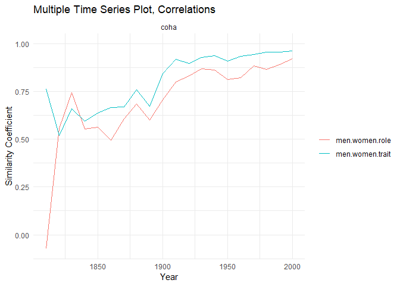
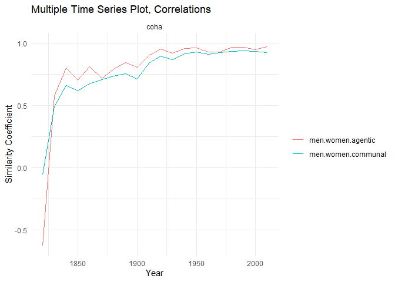

Tran_Riddle_Historical Embeddings
================
Nela Riddle
December 3, 2024

First, load in the pre-written group and word lists to be used in
analyses:

``` r
## Load in data ----
## Set WD to word stimuli
setwd("wordstim")

# Function to read and process lists
read_list <- function(file, col_name) {
  list_data <- read.delim(file, header = FALSE)
  colnames(list_data) <- col_name
  return(as.vector(list_data[[col_name]]))
}

# Specific groups (men, women)
groupwrds <- read.csv("groupstimlists.csv", header = FALSE)
groupwrds <- as.data.frame(t(groupwrds))
colnames(groupwrds) <- as.character(groupwrds[1, ])
groupwrds <- groupwrds[-1, ]

# Read lists using the function
agentic <- read_list("agentic.txt", "agentic")
communal <- read_list("communal.txt", "communal")
trait <- read_list("traitlist.txt", "trait")
job <- read_list("joblist.txt", "job")
# job <- read_list("joblistDOT.txt", "job")
fruit <- read_list("fruit.txt", "fruit")
noun <- read_list("nouns.txt", "noun")
common <- read_list("common.txt", "common")
```

The agentic and communal lists were borrowed from
<https://onlinelibrary.wiley.com/doi/10.1002/ejsp.2561>; here are some
examples

``` r
head(agentic)
```

    ## [1] "able"           "accomplish"     "accomplishment" "accuracy"       "accurate"      
    ## [6] "achieve"

``` r
head(communal)
```

    ## [1] "accept"        "acceptable"    "acceptance"    "accommodate"   "accommodation" "accompany"

The group word lists were taken from
<https://pubmed.ncbi.nlm.nih.gov/35787033/>, as well as the trait list:

``` r
head(groupwrds$men)
```

    ## [1] "men"         "man"         "male"        "males"       "masculine"   "masculinity"

``` r
head(groupwrds$women)
```

    ## [1] "women"      "woman"      "female"     "females"    "feminine"   "femininity"

``` r
head(trait)
```

    ## [1] "able"          "abrupt"        "absentminded"  "abusive"       "accommodating" "accurate"

The job titles were scraped off this site:
<https://spotterful.com/blog/job-description-template/job-titles-list-a-z>,
and expanded through nearest neighbors

    ## [1] "accompanist"   "accountant"    "actuary"       "actor"         "acupuncturist" "adjudicator"

The workhorse function; it iterates over each decade, computing the MAC
score between each word and each group, then finds the Pearson
correlation of the resulting lists (demonstrated visually later)

``` r
grpwrdassoc_rel <-
  function(group1index,
           group2index,
           wordterms,
           wordvecs.dat = wordvecs.dat,
           unavwords = unavwords,
           corpus) {
    
    start_year <- if (corpus=="coha") 1820 else 1800
    end_year <- if (corpus=="coha") 2010 else 1990
    
    # Create lists of the group's available words
    availwrds_decade_group1 <-
      lapply(1:length(wordvecs.dat), function(i) {
        groupwrds[, group1index][!groupwrds[, group1index] %in% unavwords[[i]]]
      })
    availwrds_decade_group2 <-
      lapply(1:length(wordvecs.dat), function(i) {
        groupwrds[, group2index][!groupwrds[, group2index] %in% unavwords[[i]]]
      })
    
    
    # Now compute MAC from available words for each decade
    wordvecs.mat <- list()
    mac_group1_2list <- list()
    cor_group1_2 <- list()
    cor_group1_2ts <- vector()
    for (i in 1:length(wordvecs.dat)) {
      wordvecs.mat[[i]] <- as.matrix(wordvecs.dat[[i]])
      mac_group1_2list[[i]] <-
        data.frame(
          grp1ef = mac(wordvecs.mat[[i]], S = wordterms, A = availwrds_decade_group1[[i]])$P,
          grp2ef = mac(wordvecs.mat[[i]], S = wordterms, A = availwrds_decade_group2[[i]])$P,
          trait = names(
            mac(wordvecs.mat[[i]], S = wordterms, A = availwrds_decade_group1[[i]])$P
          )
        )
      cor_group1_2[[i]] <-
        cor.test(mac_group1_2list[[i]]$grp2ef, mac_group1_2list[[i]]$grp1ef)
      cor_group1_2ts[i] <- cor_group1_2[[i]]$estimate
      cor_group1_2ts <-
        ts(
          cor_group1_2ts,
          start = start_year,
          end = end_year,
          frequency = 1 / 10
        )
      print(i)
    }
    output_rel <- list(mac_group1_2list,
                       cor_group1_2ts)
    return(output_rel)
  }
```

An example of how the mac function works (using engall 1990); here we
compute the mean average correlation of each word in the first list to
the list of animals. It makes sense that the animals in the first list
had the highest mac score.

``` r
print(mac(
  as.matrix(wordvecs.dat[[20]]),
  S = c("elephant", "horse", "tiger", "happy", "weird", "car"),
  A = c("dog", "cat", "turtle", "fish", "monkey") # the "group" words
)$P)
```

    ##   elephant      horse      tiger      happy      weird        car 
    ## 0.29825993 0.26152604 0.32429946 0.01836855 0.12177856 0.09239695

You can compute the cosine similarity of any two words by replacing the
lists with single words.

``` r
print(mac(
  as.matrix(wordvecs.dat[[20]]),
  S = "happy",
  A = "sad"
)$P)
```

    ##     happy 
    ## 0.4395598

We can plot the mac scores for two different groups against each other
like so:

``` r
plot_one_decade(get_decade("men", "women", "agentic", "coha", 1820))
```

<!-- -->

``` r
plot_one_decade(get_decade("men", "women", "agentic", "engall", 1800))
```

<!-- -->

The titles of the plots contain the Pearson coefficient, which is what
we will use to measure the similarity of the two groups.

Noticing that the 1820 coha plot had an odd correlation, let’s check the
proportion of gender words that were available, as this could be skewing
the slope.

``` r
# Calculate the number of missing group words by decade
groupmiss_coha <-
  as.data.frame(sapply(1:dim(groupwrds)[2], function(j) {
    sapply(1:length(wordvecs.dat_coha), function(i) {
      sum(groupwrds[, j] %in% unavwords_coha[[i]])
    })
  }))
colnames(groupmiss_coha) <- colnames(groupwrds)
groupmiss_coha[21,] <- colSums(groupwrds != "", na.rm = TRUE)
groupmiss2_coha <-
  as.data.frame(sapply(1:dim(groupmiss_coha)[2], function(j) {
    1 - groupmiss_coha[1:20, j] / groupmiss_coha[21, j]
  }))
colnames(groupmiss2_coha) <- colnames(groupwrds)

# Add the year column
rownames(groupmiss2_coha) <- seq(1820, 2010, by = 10)
groupmiss2_coha$year <- seq(1820, 2010, by = 10)
groupmiss2_coha
```

    ##            men     women     human  nonhuman year
    ## 1820 0.4242424 0.3714286 0.5000000 0.1111111 1820
    ## 1830 0.5757576 0.5714286 0.6428571 0.4444444 1830
    ## 1840 0.6969697 0.6571429 0.6428571 0.6111111 1840
    ## 1850 0.6666667 0.6857143 0.6428571 0.6111111 1850
    ## 1860 0.6969697 0.7142857 0.6428571 0.6666667 1860
    ## 1870 0.6969697 0.7142857 0.7142857 0.6666667 1870
    ## 1880 0.6969697 0.6857143 0.8571429 0.6111111 1880
    ## 1890 0.7272727 0.7142857 0.9285714 0.7222222 1890
    ## 1900 0.7575758 0.6857143 0.9285714 0.6111111 1900
    ## 1910 0.7272727 0.7428571 0.9285714 0.7222222 1910
    ## 1920 0.7878788 0.7428571 0.9285714 0.6111111 1920
    ## 1930 0.8181818 0.6857143 1.0000000 0.7222222 1930
    ## 1940 0.8181818 0.7142857 0.9285714 0.7222222 1940
    ## 1950 0.8181818 0.7142857 0.9285714 0.7222222 1950
    ## 1960 0.7575758 0.7142857 1.0000000 0.8333333 1960
    ## 1970 0.7575758 0.6857143 1.0000000 0.8888889 1970
    ## 1980 0.7878788 0.6571429 1.0000000 0.8888889 1980
    ## 1990 0.7272727 0.6857143 1.0000000 0.8333333 1990
    ## 2000 0.6969697 0.7142857 1.0000000 0.8888889 2000
    ## 2010 0.7575758 0.7142857 1.0000000 0.8333333 2010

``` r
# Create the plot
ggplot(groupmiss2_coha, aes(x = year)) +
  geom_line(aes(y = men, color = "Men")) +
  geom_line(aes(y = women, color = "Women")) +
  scale_color_manual(values = c("Men" = "blue", "Women" = "red")) +
  labs(title = "prop. group words available over time",
       x = "Years",
       y = "Values",
       color = "Legend") +
  theme_minimal()
```

<!-- -->
Clearly many fewer words were available in that first decade; let’s
check for statistical outliers.

``` r
find_outliers <- function(column, year) {
  is_outlier <-
    abs(column - mean(column, na.rm = TRUE)) > 3 * sd(column, na.rm = TRUE)
  data.frame(Decade = year[is_outlier], Value = column[is_outlier])
}

# Find outliers for men and women
outliers_men <-
  find_outliers(groupmiss2_coha$men, groupmiss2_coha$year)
outliers_women <-
  find_outliers(groupmiss2_coha$women, groupmiss2_coha$year)

# Print results
outliers_men
```

    ##   Decade     Value
    ## 1   1820 0.4242424

``` r
outliers_women
```

    ##   Decade     Value
    ## 1   1820 0.3714286

Repeat for engall:

``` r
# Calculate the number of missing group words by decade
groupmiss <-
  as.data.frame(sapply(1:dim(groupwrds)[2], function(j) {
    sapply(1:length(wordvecs.dat), function(i) {
      sum(groupwrds[, j] %in% unavwords[[i]])
    })
  }))
colnames(groupmiss) <- colnames(groupwrds)
groupmiss[21,] <- colSums(groupwrds != "", na.rm = TRUE)
groupmiss2 <-
  as.data.frame(sapply(1:dim(groupmiss)[2], function(j) {
    1 - groupmiss[1:20, j] / groupmiss[21, j]
  }))
colnames(groupmiss2) <- colnames(groupwrds)

# Add the year column
rownames(groupmiss2) <- seq(1800, 1990, by = 10)
groupmiss2$year <- seq(1800, 1990, by = 10)
groupmiss2
```

    ##            men     women     human  nonhuman year
    ## 1800 0.7272727 0.6571429 0.6428571 0.5555556 1800
    ## 1810 0.7575758 0.7142857 0.7142857 0.6111111 1810
    ## 1820 0.7878788 0.8000000 0.7142857 0.6111111 1820
    ## 1830 0.7878788 0.8000000 0.7142857 0.6111111 1830
    ## 1840 0.7878788 0.8285714 0.7142857 0.7777778 1840
    ## 1850 0.7878788 0.8285714 0.8571429 0.7777778 1850
    ## 1860 0.7878788 0.8285714 0.8571429 0.7777778 1860
    ## 1870 0.7878788 0.8000000 0.9285714 0.8333333 1870
    ## 1880 0.8484848 0.8857143 0.9285714 0.8333333 1880
    ## 1890 0.8484848 0.9142857 0.9285714 0.8333333 1890
    ## 1900 0.8484848 0.9142857 0.9285714 0.8333333 1900
    ## 1910 0.8787879 0.8571429 1.0000000 0.8333333 1910
    ## 1920 0.8484848 0.8857143 1.0000000 0.8333333 1920
    ## 1930 0.8484848 0.8285714 1.0000000 0.8333333 1930
    ## 1940 0.8484848 0.8285714 1.0000000 0.8333333 1940
    ## 1950 0.8787879 0.8857143 1.0000000 0.8333333 1950
    ## 1960 0.9090909 0.9428571 1.0000000 0.9444444 1960
    ## 1970 0.9393939 0.9428571 1.0000000 1.0000000 1970
    ## 1980 0.9696970 0.9714286 1.0000000 1.0000000 1980
    ## 1990 1.0000000 1.0000000 1.0000000 1.0000000 1990

``` r
# Create the plot
ggplot(groupmiss2, aes(x = year)) +
  geom_line(aes(y = men, color = "Men")) +
  geom_line(aes(y = women, color = "Women")) +
  scale_color_manual(values = c("Men" = "blue", "Women" = "red")) +
  labs(title = "prop. group words available over time",
       x = "Years",
       y = "Values",
       color = "Legend") +
  theme_minimal()
```

<!-- -->

``` r
# Find outliers for men and women
outliers_men <-
  find_outliers(groupmiss2$men, groupmiss2_coha$year)
outliers_women <-
  find_outliers(groupmiss2$women, groupmiss2_coha$year)

# Print results
outliers_men
```

    ## [1] Decade Value 
    ## <0 rows> (or 0-length row.names)

``` r
outliers_women
```

    ## [1] Decade Value 
    ## <0 rows> (or 0-length row.names)

Engall has no outliers, as expected.

Now we can begin to plot the actual correlation values over time,
starting with engall:

``` r
men_women_trait_job_ts <-
  list(
    get_ts("men", "women", "trait", "engall"),
    get_ts("men", "women", "job", "engall")
  )
plot_multiple_ts(men_women_trait_job_ts)
```

<!-- -->

``` r
men_women_agentic_communal_ts <-
  list(
    get_ts("men", "women", "agentic", "engall"),
    get_ts("men", "women", "communal", "engall")
  )
plot_multiple_ts(men_women_agentic_communal_ts)
```

<!-- -->

Now, let’s look at the actual magnitudes of the mac scores (rather than
the Pearson correlations). To do this, we take the mean of all mac
scores with a single group.

``` r
men_women_trait_job_ts <-
  list(
    get_ts_averages("men", "agentic", "engall"),
    get_ts_averages("men", "communal", "engall"),
    get_ts_averages("women", "agentic", "engall"),
    get_ts_averages("women", "communal", "engall")
  )
plot_multiple_ts_averages(men_women_trait_job_ts)
```

<!-- -->

We can also do a baseline test with different groups to see if the
men/women correlations are uniquely high.

``` r
human_nonhuman_ts <-
  list(
    get_ts("nonhuman", "women", "trait", "coha"),
    get_ts("nonhuman", "men", "trait", "coha"),
    get_ts("nonhuman", "women", "trait", "engall"),
    get_ts("nonhuman", "men", "trait", "engall"),
    get_ts("men", "women", "trait", "engall"),
    get_ts("men", "women", "trait", "coha")
  )
plot_multiple_ts(human_nonhuman_ts)
```

<!-- -->

``` r
plot_one_decade(get_decade("nonhuman", "women", "trait", "engall", 1890))
```

    ## Warning: Removed 81 rows containing non-finite values (`stat_smooth()`).

    ## Warning: Removed 81 rows containing missing values (`geom_point()`).

    ## Warning: Removed 81 rows containing missing values (`geom_text()`).

<!-- -->

``` r
men_women_trait_job_ts <-
  list(
    get_ts("men", "women", "trait", "coha"),
    get_ts("men", "women", "job", "coha")
  )
plot_multiple_ts(men_women_trait_job_ts)
```

<!-- -->

``` r
men_women_agentic_communal_ts <-
  list(
    get_ts("men", "women", "agentic", "coha"),
    get_ts("men", "women", "communal", "coha")
  )
plot_multiple_ts(men_women_agentic_communal_ts)
```

<!-- -->

``` r
men_women_trait_job_ts <-
  list(
    get_ts_averages("men", "agentic", "coha"),
    get_ts_averages("men", "communal", "coha"),
    get_ts_averages("women", "agentic", "coha"),
    get_ts_averages("women", "communal", "coha")
  )
plot_multiple_ts_averages(men_women_trait_job_ts)
```

<!-- -->

``` r
overall_results
```

    ##     year        value group1index group2index wordterms corpus
    ## 1   1800  0.760842683         men       women   agentic engall
    ## 2   1810  0.796644299         men       women   agentic engall
    ## 3   1820  0.789683161         men       women   agentic engall
    ## 4   1830  0.764452981         men       women   agentic engall
    ## 5   1840  0.775087084         men       women   agentic engall
    ## 6   1850  0.765103909         men       women   agentic engall
    ## 7   1860  0.807124935         men       women   agentic engall
    ## 8   1870  0.811407493         men       women   agentic engall
    ## 9   1880  0.843118391         men       women   agentic engall
    ## 10  1890  0.833993111         men       women   agentic engall
    ## 11  1900  0.881129571         men       women   agentic engall
    ## 12  1910  0.901092628         men       women   agentic engall
    ## 13  1920  0.890540809         men       women   agentic engall
    ## 14  1930  0.896795647         men       women   agentic engall
    ## 15  1940  0.914413222         men       women   agentic engall
    ## 16  1950  0.922597205         men       women   agentic engall
    ## 17  1960  0.914605948         men       women   agentic engall
    ## 18  1970  0.926275997         men       women   agentic engall
    ## 19  1980  0.928881462         men       women   agentic engall
    ## 20  1990  0.932408219         men       women   agentic engall
    ## 21  1820 -0.058070332         men       women  communal   coha
    ## 22  1830  0.490158691         men       women  communal   coha
    ## 23  1840  0.658436602         men       women  communal   coha
    ## 24  1850  0.615971651         men       women  communal   coha
    ## 25  1860  0.676190518         men       women  communal   coha
    ## 26  1870  0.709043911         men       women  communal   coha
    ## 27  1880  0.736981266         men       women  communal   coha
    ## 28  1890  0.754264165         men       women  communal   coha
    ## 29  1900  0.711885313         men       women  communal   coha
    ## 30  1910  0.840723006         men       women  communal   coha
    ## 31  1920  0.895764292         men       women  communal   coha
    ## 32  1930  0.867511893         men       women  communal   coha
    ## 33  1940  0.912584415         men       women  communal   coha
    ## 34  1950  0.929509280         men       women  communal   coha
    ## 35  1960  0.909977596         men       women  communal   coha
    ## 36  1970  0.922501136         men       women  communal   coha
    ## 37  1980  0.931871895         men       women  communal   coha
    ## 38  1990  0.940654017         men       women  communal   coha
    ## 39  2000  0.933521000         men       women  communal   coha
    ## 40  2010  0.922381659         men       women  communal   coha
    ## 41  1820 -0.587221888         men       women      noun   coha
    ## 42  1830  0.602717677         men       women      noun   coha
    ## 43  1840  0.644735948         men       women      noun   coha
    ## 44  1850  0.655264923         men       women      noun   coha
    ## 45  1860  0.635340679         men       women      noun   coha
    ## 46  1870  0.759115217         men       women      noun   coha
    ## 47  1880  0.750767361         men       women      noun   coha
    ## 48  1890  0.811442934         men       women      noun   coha
    ## 49  1900  0.719674086         men       women      noun   coha
    ## 50  1910  0.875822716         men       women      noun   coha
    ## 51  1920  0.846840760         men       women      noun   coha
    ## 52  1930  0.763977547         men       women      noun   coha
    ## 53  1940  0.895703771         men       women      noun   coha
    ## 54  1950  0.911641076         men       women      noun   coha
    ## 55  1960  0.919002676         men       women      noun   coha
    ## 56  1970  0.925725558         men       women      noun   coha
    ## 57  1980  0.895359690         men       women      noun   coha
    ## 58  1990  0.898093822         men       women      noun   coha
    ## 59  2000  0.936534373         men       women      noun   coha
    ## 60  2010  0.894404404         men       women      noun   coha
    ## 61  1820  0.566616199    nonhuman       women      noun   coha
    ## 62  1830  0.430929903    nonhuman       women      noun   coha
    ## 63  1840  0.185031386    nonhuman       women      noun   coha
    ## 64  1850  0.264807506    nonhuman       women      noun   coha
    ## 65  1860  0.330575348    nonhuman       women      noun   coha
    ## 66  1870  0.412508239    nonhuman       women      noun   coha
    ## 67  1880  0.279342507    nonhuman       women      noun   coha
    ## 68  1890  0.360038362    nonhuman       women      noun   coha
    ## 69  1900  0.315820842    nonhuman       women      noun   coha
    ## 70  1910  0.570710142    nonhuman       women      noun   coha
    ## 71  1920  0.463363755    nonhuman       women      noun   coha
    ## 72  1930  0.328295681    nonhuman       women      noun   coha
    ## 73  1940  0.610728923    nonhuman       women      noun   coha
    ## 74  1950  0.577728352    nonhuman       women      noun   coha
    ## 75  1960  0.558506764    nonhuman       women      noun   coha
    ## 76  1970  0.621305923    nonhuman       women      noun   coha
    ## 77  1980  0.685338592    nonhuman       women      noun   coha
    ## 78  1990  0.615783403    nonhuman       women      noun   coha
    ## 79  2000  0.758961855    nonhuman       women      noun   coha
    ## 80  2010  0.620780546    nonhuman       women      noun   coha
    ## 81  1800  0.746513379         men       women     trait engall
    ## 82  1810  0.716245976         men       women     trait engall
    ## 83  1820  0.725254398         men       women     trait engall
    ## 84  1830  0.739975977         men       women     trait engall
    ## 85  1840  0.748961283         men       women     trait engall
    ## 86  1850  0.732136716         men       women     trait engall
    ## 87  1860  0.726499573         men       women     trait engall
    ## 88  1870  0.786032934         men       women     trait engall
    ## 89  1880  0.809115148         men       women     trait engall
    ## 90  1890  0.806266230         men       women     trait engall
    ## 91  1900  0.837665722         men       women     trait engall
    ## 92  1910  0.886379555         men       women     trait engall
    ## 93  1920  0.859679201         men       women     trait engall
    ## 94  1930  0.869500205         men       women     trait engall
    ## 95  1940  0.879814419         men       women     trait engall
    ## 96  1950  0.897519214         men       women     trait engall
    ## 97  1960  0.913785636         men       women     trait engall
    ## 98  1970  0.932468188         men       women     trait engall
    ## 99  1980  0.930379071         men       women     trait engall
    ## 100 1990  0.940208669         men       women     trait engall
    ## 101 1800  0.765859546         men       women       job engall
    ## 102 1810  0.751423800         men       women       job engall
    ## 103 1820  0.809115575         men       women       job engall
    ## 104 1830  0.813326156         men       women       job engall
    ## 105 1840  0.807716058         men       women       job engall
    ## 106 1850  0.768058068         men       women       job engall
    ## 107 1860  0.790990806         men       women       job engall
    ## 108 1870  0.766410008         men       women       job engall
    ## 109 1880  0.805008326         men       women       job engall
    ## 110 1890  0.775967430         men       women       job engall
    ## 111 1900  0.841819395         men       women       job engall
    ## 112 1910  0.877505950         men       women       job engall
    ## 113 1920  0.849473198         men       women       job engall
    ## 114 1930  0.850999883         men       women       job engall
    ## 115 1940  0.867569060         men       women       job engall
    ## 116 1950  0.875564440         men       women       job engall
    ## 117 1960  0.883126446         men       women       job engall
    ## 118 1970  0.883936326         men       women       job engall
    ## 119 1980  0.900365286         men       women       job engall
    ## 120 1990  0.927244040         men       women       job engall
    ## 121 1800  0.793520434         men       women  communal engall
    ## 122 1810  0.761741222         men       women  communal engall
    ## 123 1820  0.760797403         men       women  communal engall
    ## 124 1830  0.772749482         men       women  communal engall
    ## 125 1840  0.795386929         men       women  communal engall
    ## 126 1850  0.745564486         men       women  communal engall
    ## 127 1860  0.783691609         men       women  communal engall
    ## 128 1870  0.770149043         men       women  communal engall
    ## 129 1880  0.811450334         men       women  communal engall
    ## 130 1890  0.777605421         men       women  communal engall
    ## 131 1900  0.843665994         men       women  communal engall
    ## 132 1910  0.866382925         men       women  communal engall
    ## 133 1920  0.869048731         men       women  communal engall
    ## 134 1930  0.875490601         men       women  communal engall
    ## 135 1940  0.891200530         men       women  communal engall
    ## 136 1950  0.905834539         men       women  communal engall
    ## 137 1960  0.895021513         men       women  communal engall
    ## 138 1970  0.906798350         men       women  communal engall
    ## 139 1980  0.899595359         men       women  communal engall
    ## 140 1990  0.895167270         men       women  communal engall
    ## 141 1820 -0.554505545    nonhuman       women     trait   coha
    ## 142 1830  0.494246556    nonhuman       women     trait   coha
    ## 143 1840  0.304141672    nonhuman       women     trait   coha
    ## 144 1850  0.306778044    nonhuman       women     trait   coha
    ## 145 1860  0.342810746    nonhuman       women     trait   coha
    ## 146 1870  0.369395962    nonhuman       women     trait   coha
    ## 147 1880  0.202448202    nonhuman       women     trait   coha
    ## 148 1890  0.297731029    nonhuman       women     trait   coha
    ## 149 1900  0.204889837    nonhuman       women     trait   coha
    ## 150 1910  0.559416695    nonhuman       women     trait   coha
    ## 151 1920  0.557186183    nonhuman       women     trait   coha
    ## 152 1930  0.450709577    nonhuman       women     trait   coha
    ## 153 1940  0.592439881    nonhuman       women     trait   coha
    ## 154 1950  0.675232272    nonhuman       women     trait   coha
    ## 155 1960  0.601201574    nonhuman       women     trait   coha
    ## 156 1970  0.671792577    nonhuman       women     trait   coha
    ## 157 1980  0.685192504    nonhuman       women     trait   coha
    ## 158 1990  0.694231344    nonhuman       women     trait   coha
    ## 159 2000  0.752591864    nonhuman       women     trait   coha
    ## 160 2010  0.580528317    nonhuman       women     trait   coha
    ## 161 1820 -0.627015870    nonhuman         men     trait   coha
    ## 162 1830 -0.005685153    nonhuman         men     trait   coha
    ## 163 1840  0.211899305    nonhuman         men     trait   coha
    ## 164 1850 -0.062825261    nonhuman         men     trait   coha
    ## 165 1860  0.377140811    nonhuman         men     trait   coha
    ## 166 1870 -0.002812332    nonhuman         men     trait   coha
    ##  [ reached 'max' / getOption("max.print") -- omitted 114 rows ]

``` r
write_xlsx(overall_results, "overall_results.xlsx")
```

``` r
overall_results_averages
```

    ##     year         value group1index wordterms corpus
    ## 1   1800  0.0177768231         men   agentic engall
    ## 2   1810  0.0131675367         men   agentic engall
    ## 3   1820  0.0044115635         men   agentic engall
    ## 4   1830  0.0089454626         men   agentic engall
    ## 5   1840  0.0039480938         men   agentic engall
    ## 6   1850  0.0114622370         men   agentic engall
    ## 7   1860  0.0126314182         men   agentic engall
    ## 8   1870  0.0144240210         men   agentic engall
    ## 9   1880  0.0155410936         men   agentic engall
    ## 10  1890  0.0118243255         men   agentic engall
    ## 11  1900  0.0169323555         men   agentic engall
    ## 12  1910  0.0111440144         men   agentic engall
    ## 13  1920  0.0119224152         men   agentic engall
    ## 14  1930  0.0106578376         men   agentic engall
    ## 15  1940  0.0164046010         men   agentic engall
    ## 16  1950  0.0169276706         men   agentic engall
    ## 17  1960  0.0201536851         men   agentic engall
    ## 18  1970  0.0243779101         men   agentic engall
    ## 19  1980  0.0229261632         men   agentic engall
    ## 20  1990  0.0234486331         men   agentic engall
    ## 21  1800  0.0472969614         men  communal engall
    ## 22  1810  0.0287652402         men  communal engall
    ## 23  1820  0.0213427431         men  communal engall
    ## 24  1830  0.0221437034         men  communal engall
    ## 25  1840  0.0229844623         men  communal engall
    ## 26  1850  0.0278155672         men  communal engall
    ## 27  1860  0.0248924411         men  communal engall
    ## 28  1870  0.0240983425         men  communal engall
    ## 29  1880  0.0281692915         men  communal engall
    ## 30  1890  0.0249589834         men  communal engall
    ## 31  1900  0.0327392380         men  communal engall
    ## 32  1910  0.0297627941         men  communal engall
    ## 33  1920  0.0300824091         men  communal engall
    ## 34  1930  0.0318884882         men  communal engall
    ## 35  1940  0.0377742716         men  communal engall
    ## 36  1950  0.0378994415         men  communal engall
    ## 37  1960  0.0447009196         men  communal engall
    ## 38  1970  0.0448945746         men  communal engall
    ## 39  1980  0.0433478246         men  communal engall
    ## 40  1990  0.0392736368         men  communal engall
    ## 41  1800 -0.0100943932       women   agentic engall
    ## 42  1810 -0.0039910372       women   agentic engall
    ## 43  1820 -0.0136422253       women   agentic engall
    ## 44  1830 -0.0109155805       women   agentic engall
    ## 45  1840 -0.0182478370       women   agentic engall
    ## 46  1850 -0.0066279751       women   agentic engall
    ## 47  1860 -0.0124948530       women   agentic engall
    ## 48  1870 -0.0106454909       women   agentic engall
    ## 49  1880 -0.0097444508       women   agentic engall
    ## 50  1890 -0.0068469594       women   agentic engall
    ## 51  1900 -0.0100412423       women   agentic engall
    ## 52  1910 -0.0062723881       women   agentic engall
    ## 53  1920 -0.0111330501       women   agentic engall
    ## 54  1930 -0.0103049767       women   agentic engall
    ## 55  1940 -0.0087953462       women   agentic engall
    ## 56  1950 -0.0049001743       women   agentic engall
    ## 57  1960 -0.0032729566       women   agentic engall
    ## 58  1970  0.0027796820       women   agentic engall
    ## 59  1980  0.0047489821       women   agentic engall
    ## 60  1990  0.0026291566       women   agentic engall
    ## 61  1800  0.0568227785       women  communal engall
    ## 62  1810  0.0334697975       women  communal engall
    ## 63  1820  0.0254810097       women  communal engall
    ## 64  1830  0.0246386296       women  communal engall
    ## 65  1840  0.0227199619       women  communal engall
    ## 66  1850  0.0273180036       women  communal engall
    ## 67  1860  0.0264891528       women  communal engall
    ## 68  1870  0.0279686210       women  communal engall
    ## 69  1880  0.0292325258       women  communal engall
    ## 70  1890  0.0271382746       women  communal engall
    ## 71  1900  0.0267914972       women  communal engall
    ## 72  1910  0.0294612892       women  communal engall
    ## 73  1920  0.0264745161       women  communal engall
    ## 74  1930  0.0250351204       women  communal engall
    ## 75  1940  0.0314754479       women  communal engall
    ## 76  1950  0.0341980963       women  communal engall
    ## 77  1960  0.0363039847       women  communal engall
    ## 78  1970  0.0385027372       women  communal engall
    ## 79  1980  0.0366764316       women  communal engall
    ## 80  1990  0.0312876292       women  communal engall
    ## 81  1820  0.0845202439         men   agentic   coha
    ## 82  1830  0.0369862195         men   agentic   coha
    ## 83  1840  0.0172848952         men   agentic   coha
    ## 84  1850  0.0014748534         men   agentic   coha
    ## 85  1860  0.0181575447         men   agentic   coha
    ## 86  1870  0.0014499283         men   agentic   coha
    ## 87  1880  0.0229060216         men   agentic   coha
    ## 88  1890  0.0234923854         men   agentic   coha
    ## 89  1900  0.0292764554         men   agentic   coha
    ## 90  1910  0.0451640654         men   agentic   coha
    ## 91  1920  0.0474601659         men   agentic   coha
    ## 92  1930  0.0487640281         men   agentic   coha
    ## 93  1940  0.0508831574         men   agentic   coha
    ## 94  1950  0.0557223535         men   agentic   coha
    ## 95  1960  0.0410745432         men   agentic   coha
    ## 96  1970  0.0409043147         men   agentic   coha
    ## 97  1980  0.0691725373         men   agentic   coha
    ## 98  1990  0.0778884042         men   agentic   coha
    ## 99  2000  0.0655393084         men   agentic   coha
    ## 100 2010  0.1130006015         men   agentic   coha
    ## 101 1820  0.0683152209         men  communal   coha
    ## 102 1830  0.0709454687         men  communal   coha
    ## 103 1840  0.0425942305         men  communal   coha
    ## 104 1850  0.0233217474         men  communal   coha
    ## 105 1860  0.0383183310         men  communal   coha
    ## 106 1870  0.0243480445         men  communal   coha
    ## 107 1880  0.0469163573         men  communal   coha
    ## 108 1890  0.0482587040         men  communal   coha
    ## 109 1900  0.0507001167         men  communal   coha
    ## 110 1910  0.0630797188         men  communal   coha
    ## 111 1920  0.0697231345         men  communal   coha
    ## 112 1930  0.0763986820         men  communal   coha
    ## 113 1940  0.0787489283         men  communal   coha
    ## 114 1950  0.0784109655         men  communal   coha
    ## 115 1960  0.0677156459         men  communal   coha
    ## 116 1970  0.0691042185         men  communal   coha
    ## 117 1980  0.0893330497         men  communal   coha
    ## 118 1990  0.0929761362         men  communal   coha
    ## 119 2000  0.0934222154         men  communal   coha
    ## 120 2010  0.1253389547         men  communal   coha
    ## 121 1820  0.1834998786       women   agentic   coha
    ## 122 1830  0.0403678799       women   agentic   coha
    ## 123 1840 -0.0044068025       women   agentic   coha
    ## 124 1850  0.0003878655       women   agentic   coha
    ## 125 1860 -0.0073481485       women   agentic   coha
    ## 126 1870 -0.0022702158       women   agentic   coha
    ## 127 1880 -0.0126401864       women   agentic   coha
    ## 128 1890 -0.0030534677       women   agentic   coha
    ## 129 1900 -0.0018925372       women   agentic   coha
    ## 130 1910  0.0407958010       women   agentic   coha
    ## 131 1920  0.0449100188       women   agentic   coha
    ## 132 1930  0.0311070938       women   agentic   coha
    ## 133 1940  0.0409740162       women   agentic   coha
    ## 134 1950  0.0549758360       women   agentic   coha
    ## 135 1960  0.0371632802       women   agentic   coha
    ## 136 1970  0.0533711343       women   agentic   coha
    ## 137 1980  0.0595801712       women   agentic   coha
    ## 138 1990  0.0734545124       women   agentic   coha
    ## 139 2000  0.0927835596       women   agentic   coha
    ## 140 2010  0.0928455471       women   agentic   coha
    ## 141 1820  0.2650963385       women  communal   coha
    ## 142 1830  0.0946182956       women  communal   coha
    ## 143 1840  0.0484089458       women  communal   coha
    ## 144 1850  0.0491582083       women  communal   coha
    ## 145 1860  0.0403793187       women  communal   coha
    ## 146 1870  0.0471448904       women  communal   coha
    ## 147 1880  0.0320727857       women  communal   coha
    ## 148 1890  0.0422623696       women  communal   coha
    ## 149 1900  0.0407693083       women  communal   coha
    ## 150 1910  0.0808530381       women  communal   coha
    ## 151 1920  0.0794185220       women  communal   coha
    ## 152 1930  0.0652507437       women  communal   coha
    ## 153 1940  0.0807334903       women  communal   coha
    ## 154 1950  0.0889903367       women  communal   coha
    ## 155 1960  0.0771939239       women  communal   coha
    ## 156 1970  0.0960961370       women  communal   coha
    ## 157 1980  0.0934427090       women  communal   coha
    ## 158 1990  0.0994978235       women  communal   coha
    ## 159 2000  0.1354970327       women  communal   coha
    ## 160 2010  0.1191310476       women  communal   coha

``` r
write_xlsx(overall_results_averages, "overall_results_averages.xlsx")
```
