Tran_Riddle_Historical Embeddings
================
Nela Riddle
December 3, 2024

First, load in the pre-written group and word lists to be used in
analyses:

``` r
## Load in data ----
## Set WD to word stimuli
setwd("wordstim")

# Function to read and process lists
read_list <- function(file, col_name) {
  list_data <- read.delim(file, header = FALSE)
  colnames(list_data) <- col_name
  return(as.vector(list_data[[col_name]]))
}

# Specific groups (men, women)
groupwrds <- read.csv("groupstimlists.csv", header = FALSE)
groupwrds <- as.data.frame(t(groupwrds))
colnames(groupwrds) <- as.character(groupwrds[1, ])
groupwrds <- groupwrds[-1, ]

# Read lists using the function
agentic <- read_list("agentic.txt", "agentic")
communal <- read_list("communal.txt", "communal")
trait <- read_list("traitlist.txt", "trait")
job <- read_list("joblist.txt", "job")
# job <- read_list("joblistDOT.txt", "job")
fruit <- read_list("fruit.txt", "fruit")
noun <- read_list("nouns.txt", "noun")
common <- read_list("common.txt", "common")
```

The agentic and communal lists were borrowed from
<https://onlinelibrary.wiley.com/doi/10.1002/ejsp.2561>; here are some
examples

``` r
head(agentic)
```

    ## [1] "able"           "accomplish"     "accomplishment" "accuracy"      
    ## [5] "accurate"       "achieve"

``` r
head(communal)
```

    ## [1] "accept"        "acceptable"    "acceptance"    "accommodate"  
    ## [5] "accommodation" "accompany"

The group word lists were taken from
<https://pubmed.ncbi.nlm.nih.gov/35787033/>, as well as the trait list:

``` r
head(groupwrds$men)
```

    ## [1] "men"         "man"         "male"        "males"       "masculine"  
    ## [6] "masculinity"

``` r
head(groupwrds$women)
```

    ## [1] "women"      "woman"      "female"     "females"    "feminine"  
    ## [6] "femininity"

``` r
head(trait)
```

    ## [1] "able"          "abrupt"        "absentminded"  "abusive"      
    ## [5] "accommodating" "accurate"

The job titles were scraped off this site:
<https://spotterful.com/blog/job-description-template/job-titles-list-a-z>,
and expanded through nearest neighbors

    ## [1] "accompanist"   "accountant"    "actuary"       "actor"        
    ## [5] "acupuncturist" "adjudicator"

The workhorse function; it iterates over each decade, computing the MAC
score between each word and each group, then finds the Pearson
correlation of the resulting lists (demonstrated visually later)

``` r
grpwrdassoc_rel <-
  function(group1index,
           group2index,
           wordterms,
           wordvecs.dat = wordvecs.dat,
           unavwords = unavwords,
           corpus) {
    
    start_year <- if (corpus=="coha") 1820 else 1800
    end_year <- if (corpus=="coha") 2010 else 1990
    
    # Create lists of the group's available words
    availwrds_decade_group1 <-
      lapply(1:length(wordvecs.dat), function(i) {
        groupwrds[, group1index][!groupwrds[, group1index] %in% unavwords[[i]]]
      })
    availwrds_decade_group2 <-
      lapply(1:length(wordvecs.dat), function(i) {
        groupwrds[, group2index][!groupwrds[, group2index] %in% unavwords[[i]]]
      })
    
    
    # Now compute MAC from available words for each decade
    wordvecs.mat <- list()
    mac_group1_2list <- list()
    cor_group1_2 <- list()
    cor_group1_2ts <- vector()
    for (i in 1:length(wordvecs.dat)) {
      wordvecs.mat[[i]] <- as.matrix(wordvecs.dat[[i]])
      mac_group1_2list[[i]] <-
        data.frame(
          grp1ef = mac(wordvecs.mat[[i]], S = wordterms, A = availwrds_decade_group1[[i]])$P,
          grp2ef = mac(wordvecs.mat[[i]], S = wordterms, A = availwrds_decade_group2[[i]])$P,
          trait = names(
            mac(wordvecs.mat[[i]], S = wordterms, A = availwrds_decade_group1[[i]])$P
          )
        )
      cor_group1_2[[i]] <-
        cor.test(mac_group1_2list[[i]]$grp2ef, mac_group1_2list[[i]]$grp1ef)
      cor_group1_2ts[i] <- cor_group1_2[[i]]$estimate
      cor_group1_2ts <-
        ts(
          cor_group1_2ts,
          start = start_year,
          end = end_year,
          frequency = 1 / 10
        )
      print(i)
    }
    output_rel <- list(mac_group1_2list,
                       cor_group1_2ts)
    return(output_rel)
  }
```

An example of how the mac function works (using engall 1990); here we
compute the mean average correlation of each word in the first list to
the list of animals. It makes sense that the animals in the first list
had the highest mac score.

``` r
print(mac(
  as.matrix(wordvecs.dat[[20]]),
  S = c("elephant", "horse", "tiger", "happy", "weird", "car"),
  A = c("dog", "cat", "turtle", "fish", "monkey")
)$P)
```

    ##   elephant      horse      tiger      happy      weird        car 
    ## 0.29825993 0.26152604 0.32429946 0.01836855 0.12177856 0.09239695

You can compute the cosine similarity of any two words by replacing the
lists with single words.

``` r
print(mac(
  as.matrix(wordvecs.dat[[20]]),
  S = "happy",
  A = "sad"
)$P)
```

    ##     happy 
    ## 0.4395598

    ## [Download Time Series](./csv_outputs/men_women_agentic_engall.csv)

    ## [Download Time Series](./csv_outputs/men_women_communal_coha.csv)

    ## [Download Time Series](./csv_outputs/men_women_noun_coha.csv)

    ## [Download Time Series](./csv_outputs/nonhuman_women_noun_coha.csv)

We can plot the mac scores for two different groups against each other
like so:

``` r
plot_one_decade(get_decade("men", "women", "agentic", "coha", 1820))
```

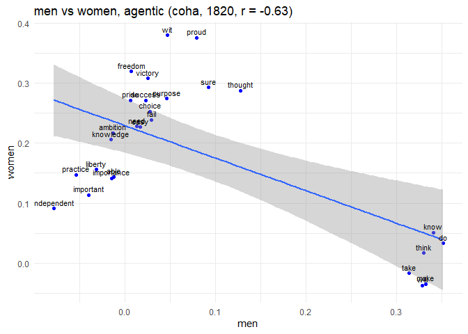<!-- -->

``` r
plot_one_decade(get_decade("men", "women", "agentic", "engall", 1800))
```

<!-- -->

The titles of the plots contain the Pearson coefficient, which is what
we use to measure the similarity of the two groups.

Noticing that the 1820 coha plot had an odd correlation, let’s check the
proportion of gender words that were available, as this could be skewing
certain words.

``` r
# Calculate the number of missing group words by decade
groupmiss_coha <-
  as.data.frame(sapply(1:dim(groupwrds)[2], function(j) {
    sapply(1:length(wordvecs.dat_coha), function(i) {
      sum(groupwrds[, j] %in% unavwords_coha[[i]])
    })
  }))
colnames(groupmiss_coha) <- colnames(groupwrds)
groupmiss_coha[21,] <- colSums(groupwrds != "", na.rm = TRUE)
groupmiss2_coha <-
  as.data.frame(sapply(1:dim(groupmiss_coha)[2], function(j) {
    1 - groupmiss_coha[1:20, j] / groupmiss_coha[21, j]
  }))
colnames(groupmiss2_coha) <- colnames(groupwrds)

# Add the year column
rownames(groupmiss2_coha) <- seq(1820, 2010, by = 10)
groupmiss2_coha$year <- seq(1820, 2010, by = 10)
groupmiss2_coha
```

    ##            men     women     human  nonhuman year
    ## 1820 0.4242424 0.3714286 0.5000000 0.1111111 1820
    ## 1830 0.5757576 0.5714286 0.6428571 0.4444444 1830
    ## 1840 0.6969697 0.6571429 0.6428571 0.6111111 1840
    ## 1850 0.6666667 0.6857143 0.6428571 0.6111111 1850
    ## 1860 0.6969697 0.7142857 0.6428571 0.6666667 1860
    ## 1870 0.6969697 0.7142857 0.7142857 0.6666667 1870
    ## 1880 0.6969697 0.6857143 0.8571429 0.6111111 1880
    ## 1890 0.7272727 0.7142857 0.9285714 0.7222222 1890
    ## 1900 0.7575758 0.6857143 0.9285714 0.6111111 1900
    ## 1910 0.7272727 0.7428571 0.9285714 0.7222222 1910
    ## 1920 0.7878788 0.7428571 0.9285714 0.6111111 1920
    ## 1930 0.8181818 0.6857143 1.0000000 0.7222222 1930
    ## 1940 0.8181818 0.7142857 0.9285714 0.7222222 1940
    ## 1950 0.8181818 0.7142857 0.9285714 0.7222222 1950
    ## 1960 0.7575758 0.7142857 1.0000000 0.8333333 1960
    ## 1970 0.7575758 0.6857143 1.0000000 0.8888889 1970
    ## 1980 0.7878788 0.6571429 1.0000000 0.8888889 1980
    ## 1990 0.7272727 0.6857143 1.0000000 0.8333333 1990
    ## 2000 0.6969697 0.7142857 1.0000000 0.8888889 2000
    ## 2010 0.7575758 0.7142857 1.0000000 0.8333333 2010

``` r
# Create the plot
ggplot(groupmiss2_coha, aes(x = year)) +
  geom_line(aes(y = men, color = "Men")) +
  geom_line(aes(y = women, color = "Women")) +
  scale_color_manual(values = c("Men" = "blue", "Women" = "red")) +
  labs(title = "prop. group words available over time",
       x = "Years",
       y = "Values",
       color = "Legend") +
  theme_minimal()
```

<!-- -->
Clearly many fewer words were available in that first decade; let’s
check for statistical outliers.

``` r
find_outliers <- function(column, year) {
  is_outlier <-
    abs(column - mean(column, na.rm = TRUE)) > 3 * sd(column, na.rm = TRUE)
  data.frame(Decade = year[is_outlier], Value = column[is_outlier])
}

# Find outliers for men and women
outliers_men <-
  find_outliers(groupmiss2_coha$men, groupmiss2_coha$year)
outliers_women <-
  find_outliers(groupmiss2_coha$women, groupmiss2_coha$year)

# Print results
outliers_men
```

    ##   Decade     Value
    ## 1   1820 0.4242424

``` r
outliers_women
```

    ##   Decade     Value
    ## 1   1820 0.3714286

Repeat for engall:

``` r
# Calculate the number of missing group words by decade
groupmiss <-
  as.data.frame(sapply(1:dim(groupwrds)[2], function(j) {
    sapply(1:length(wordvecs.dat), function(i) {
      sum(groupwrds[, j] %in% unavwords[[i]])
    })
  }))
colnames(groupmiss) <- colnames(groupwrds)
groupmiss[21,] <- colSums(groupwrds != "", na.rm = TRUE)
groupmiss2 <-
  as.data.frame(sapply(1:dim(groupmiss)[2], function(j) {
    1 - groupmiss[1:20, j] / groupmiss[21, j]
  }))
colnames(groupmiss2) <- colnames(groupwrds)

# Add the year column
rownames(groupmiss2) <- seq(1800, 1990, by = 10)
groupmiss2$year <- seq(1800, 1990, by = 10)
groupmiss2
```

    ##            men     women     human  nonhuman year
    ## 1800 0.7272727 0.6571429 0.6428571 0.5555556 1800
    ## 1810 0.7575758 0.7142857 0.7142857 0.6111111 1810
    ## 1820 0.7878788 0.8000000 0.7142857 0.6111111 1820
    ## 1830 0.7878788 0.8000000 0.7142857 0.6111111 1830
    ## 1840 0.7878788 0.8285714 0.7142857 0.7777778 1840
    ## 1850 0.7878788 0.8285714 0.8571429 0.7777778 1850
    ## 1860 0.7878788 0.8285714 0.8571429 0.7777778 1860
    ## 1870 0.7878788 0.8000000 0.9285714 0.8333333 1870
    ## 1880 0.8484848 0.8857143 0.9285714 0.8333333 1880
    ## 1890 0.8484848 0.9142857 0.9285714 0.8333333 1890
    ## 1900 0.8484848 0.9142857 0.9285714 0.8333333 1900
    ## 1910 0.8787879 0.8571429 1.0000000 0.8333333 1910
    ## 1920 0.8484848 0.8857143 1.0000000 0.8333333 1920
    ## 1930 0.8484848 0.8285714 1.0000000 0.8333333 1930
    ## 1940 0.8484848 0.8285714 1.0000000 0.8333333 1940
    ## 1950 0.8787879 0.8857143 1.0000000 0.8333333 1950
    ## 1960 0.9090909 0.9428571 1.0000000 0.9444444 1960
    ## 1970 0.9393939 0.9428571 1.0000000 1.0000000 1970
    ## 1980 0.9696970 0.9714286 1.0000000 1.0000000 1980
    ## 1990 1.0000000 1.0000000 1.0000000 1.0000000 1990

``` r
# Create the plot
ggplot(groupmiss2, aes(x = year)) +
  geom_line(aes(y = men, color = "Men")) +
  geom_line(aes(y = women, color = "Women")) +
  scale_color_manual(values = c("Men" = "blue", "Women" = "red")) +
  labs(title = "prop. group words available over time",
       x = "Years",
       y = "Values",
       color = "Legend") +
  theme_minimal()
```

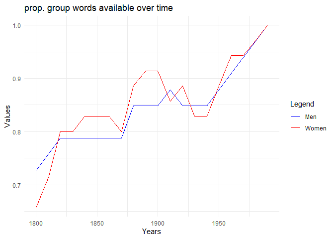<!-- -->

``` r
# Find outliers for men and women
outliers_men <-
  find_outliers(groupmiss2$men, groupmiss2_coha$year)
outliers_women <-
  find_outliers(groupmiss2$women, groupmiss2_coha$year)

# Print results
outliers_men
```

    ## [1] Decade Value 
    ## <0 rows> (or 0-length row.names)

``` r
outliers_women
```

    ## [1] Decade Value 
    ## <0 rows> (or 0-length row.names)

Engall has no outliers, as expected.

Now we can begin to plot the actual correlation values over time,
starting with engall:

``` r
men_women_trait_job_ts <-
  list(
    get_ts("men", "women", "trait", "engall"),
    get_ts("men", "women", "job", "engall")
  )
```

    ## [Download Time Series](./csv_outputs/men_women_trait_engall.csv) 
    ## [Download Time Series](./csv_outputs/men_women_job_engall.csv)

``` r
plot_multiple_ts(men_women_trait_job_ts)
```

    ##    Year     Value group1 group2 word_term corpus
    ## 1  1800 0.7465134    men  women     trait engall
    ## 2  1810 0.7162460    men  women     trait engall
    ## 3  1820 0.7252544    men  women     trait engall
    ## 4  1830 0.7399760    men  women     trait engall
    ## 5  1840 0.7489613    men  women     trait engall
    ## 6  1850 0.7321367    men  women     trait engall
    ## 7  1860 0.7264996    men  women     trait engall
    ## 8  1870 0.7860329    men  women     trait engall
    ## 9  1880 0.8091151    men  women     trait engall
    ## 10 1890 0.8062662    men  women     trait engall
    ## 11 1900 0.8376657    men  women     trait engall
    ## 12 1910 0.8863796    men  women     trait engall
    ## 13 1920 0.8596792    men  women     trait engall
    ## 14 1930 0.8695002    men  women     trait engall
    ## 15 1940 0.8798144    men  women     trait engall
    ## 16 1950 0.8975192    men  women     trait engall
    ## 17 1960 0.9137856    men  women     trait engall
    ## 18 1970 0.9324682    men  women     trait engall
    ## 19 1980 0.9303791    men  women     trait engall
    ## 20 1990 0.9402087    men  women     trait engall
    ## 21 1800 0.7658595    men  women       job engall
    ## 22 1810 0.7514238    men  women       job engall
    ## 23 1820 0.8091156    men  women       job engall
    ## 24 1830 0.8133262    men  women       job engall
    ## 25 1840 0.8077161    men  women       job engall
    ## 26 1850 0.7680581    men  women       job engall
    ## 27 1860 0.7909908    men  women       job engall
    ## 28 1870 0.7664100    men  women       job engall
    ## 29 1880 0.8050083    men  women       job engall
    ## 30 1890 0.7759674    men  women       job engall
    ## 31 1900 0.8418194    men  women       job engall
    ## 32 1910 0.8775059    men  women       job engall
    ## 33 1920 0.8494732    men  women       job engall
    ## 34 1930 0.8509999    men  women       job engall
    ## 35 1940 0.8675691    men  women       job engall
    ## 36 1950 0.8755644    men  women       job engall
    ## 37 1960 0.8831264    men  women       job engall
    ## 38 1970 0.8839363    men  women       job engall
    ## 39 1980 0.9003653    men  women       job engall
    ## 40 1990 0.9272440    men  women       job engall

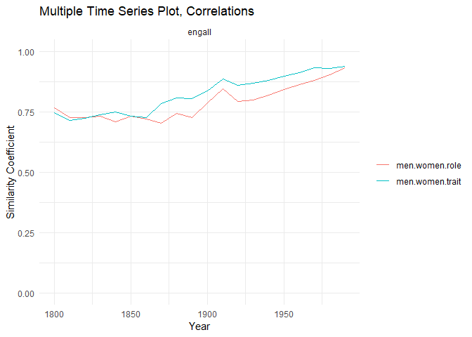<!-- -->

``` r
men_women_agentic_communal_ts <-
  list(
    get_ts("men", "women", "agentic", "engall"),
    get_ts("men", "women", "communal", "engall")
  )
```

    ## [Download Time Series](./csv_outputs/men_women_agentic_engall.csv) 
    ## [Download Time Series](./csv_outputs/men_women_communal_engall.csv)

``` r
plot_multiple_ts(men_women_agentic_communal_ts)
```

    ##    Year     Value group1 group2 word_term corpus
    ## 1  1800 0.7608427    men  women   agentic engall
    ## 2  1810 0.7966443    men  women   agentic engall
    ## 3  1820 0.7896832    men  women   agentic engall
    ## 4  1830 0.7644530    men  women   agentic engall
    ## 5  1840 0.7750871    men  women   agentic engall
    ## 6  1850 0.7651039    men  women   agentic engall
    ## 7  1860 0.8071249    men  women   agentic engall
    ## 8  1870 0.8114075    men  women   agentic engall
    ## 9  1880 0.8431184    men  women   agentic engall
    ## 10 1890 0.8339931    men  women   agentic engall
    ## 11 1900 0.8811296    men  women   agentic engall
    ## 12 1910 0.9010926    men  women   agentic engall
    ## 13 1920 0.8905408    men  women   agentic engall
    ## 14 1930 0.8967956    men  women   agentic engall
    ## 15 1940 0.9144132    men  women   agentic engall
    ## 16 1950 0.9225972    men  women   agentic engall
    ## 17 1960 0.9146059    men  women   agentic engall
    ## 18 1970 0.9262760    men  women   agentic engall
    ## 19 1980 0.9288815    men  women   agentic engall
    ## 20 1990 0.9324082    men  women   agentic engall
    ## 21 1800 0.7935204    men  women  communal engall
    ## 22 1810 0.7617412    men  women  communal engall
    ## 23 1820 0.7607974    men  women  communal engall
    ## 24 1830 0.7727495    men  women  communal engall
    ## 25 1840 0.7953869    men  women  communal engall
    ## 26 1850 0.7455645    men  women  communal engall
    ## 27 1860 0.7836916    men  women  communal engall
    ## 28 1870 0.7701490    men  women  communal engall
    ## 29 1880 0.8114503    men  women  communal engall
    ## 30 1890 0.7776054    men  women  communal engall
    ## 31 1900 0.8436660    men  women  communal engall
    ## 32 1910 0.8663829    men  women  communal engall
    ## 33 1920 0.8690487    men  women  communal engall
    ## 34 1930 0.8754906    men  women  communal engall
    ## 35 1940 0.8912005    men  women  communal engall
    ## 36 1950 0.9058345    men  women  communal engall
    ## 37 1960 0.8950215    men  women  communal engall
    ## 38 1970 0.9067983    men  women  communal engall
    ## 39 1980 0.8995954    men  women  communal engall
    ## 40 1990 0.8951673    men  women  communal engall

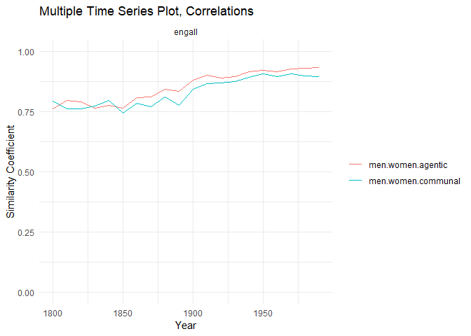<!-- -->
Now, let’s look at the actual magnitudes of the mac scores.

``` r
plot_multiple_ts_averages <- function(ts_list) {
  combined_df <- data.frame()
  for (i in seq_along(ts_list)) {
    ts_data <- ts_list[[i]]
    ts_df <- data.frame(
      Year = seq(from = 1800, to = 1990, by = 10),
      Value = as.vector(ts_data),
      group1 = attr(ts_data, "group1index"),
      word_term = attr(ts_data, "wordterms"),
      corpus = attr(ts_data, "corpus")
    )
    combined_df <- rbind(combined_df, ts_df)
  }
  p <-
    ggplot(combined_df, aes(
      x = Year,
      y = Value,
      color = interaction(group1, word_term)
    )) +
    geom_line() +
    labs(title = "Multiple Time Series Plot", x = "Year", y = "Similarity Coefficient") +
    facet_wrap( ~ word_term, scales = "fixed") +
    scale_y_continuous(limits = c(-.1, .1)) +
    theme_minimal() + guides(color = guide_legend(title = NULL))
  
  return(p)
}
```

``` r
men_women_trait_job_ts <-
  list(
    get_ts_averages("men", "agentic", "engall"),
    get_ts_averages("men", "communal", "engall"),
    get_ts_averages("women", "agentic", "engall"),
    get_ts_averages("women", "communal", "engall")
  )
plot_multiple_ts_averages(men_women_trait_job_ts)
```

<!-- -->

``` r
# Initialize an empty data frame to store results
results_df <- data.frame()

# Define the parameters to iterate over
categories <- c("agentic", "communal")
corpora <- c("coha", "engall")
years <- seq(1800, 2010, by = 10)

# Loop through each year
for (year in years) {
  # Create a temporary vector to store the values for the current year
  temp_row <- c(year)
  
  # Loop through each combination of trait and corpus
  for (category in categories) {
    for (corpus in corpora) {
      if ((year >= 1820 & corpus == "coha") | (year <= 1990 & corpus == "engall")) {
        df <- get_decade("men", "women", category, corpus, year)
        mean_men <- mean(df$grp1ef, na.rm = TRUE)
        mean_women <- mean(df$grp2ef, na.rm = TRUE)
        temp_row <- c(temp_row, mean_men, mean_women)
      } else{
        temp_row <- c(temp_row, NaN, NaN)
      }
    }
  }
  results_df <- rbind(results_df, temp_row)
}

# Set the column names for the results data frame
colnames(results_df) <- c(
  "year",
  "agentic_coha_men", "agentic_coha_women",
  "agentic_engall_men", "agentic_engall_women",
  "communal_coha_men", "communal_coha_women",
  "communal_engall_men", "communal_engall_women"
)

# Display the results
generate_trait_corpus_plot <- function(data, trait, corpus) {
  # Dynamically generate column names
  y_men <- paste0(trait, "_", corpus, "_men")
  y_women <- paste0(trait, "_", corpus, "_women")
  
  # Generate title
  title <- paste(trait, corpus, sep = ", ")
  
  # Create the plot
  ggplot(data, aes(x = year)) +
    geom_line(aes_string(y = y_men, color = "'Men'")) +
    geom_line(aes_string(y = y_women, color = "'Women'")) +
    labs(
      title = title,
      x = "Year",
      y = "Mean Values",
      color = "Group"
    ) +
    theme_minimal() +
    scale_color_manual(values = c("Men" = "blue", "Women" = "red"))
}

generate_trait_corpus_plot(results_df, "communal", "coha")
```

    ## Warning: Removed 2 rows containing missing values (`geom_line()`).
    ## Removed 2 rows containing missing values (`geom_line()`).

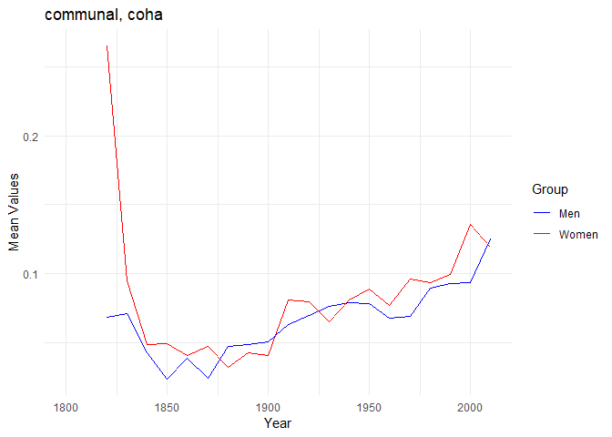<!-- -->

``` r
generate_trait_corpus_plot(results_df, "agentic", "coha")
```

    ## Warning: Removed 2 rows containing missing values (`geom_line()`).
    ## Removed 2 rows containing missing values (`geom_line()`).

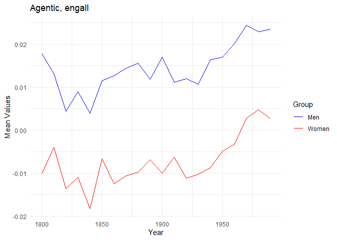<!-- -->

``` r
generate_trait_corpus_plot(results_df, "communal", "engall")
```

    ## Warning: Removed 2 rows containing missing values (`geom_line()`).
    ## Removed 2 rows containing missing values (`geom_line()`).

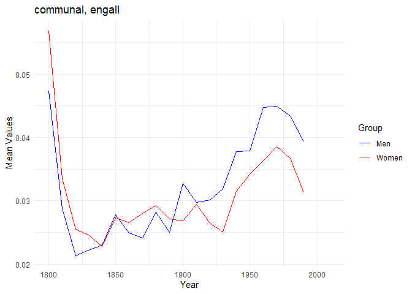<!-- -->

``` r
generate_trait_corpus_plot(results_df, "agentic", "engall")
```

    ## Warning: Removed 2 rows containing missing values (`geom_line()`).
    ## Removed 2 rows containing missing values (`geom_line()`).

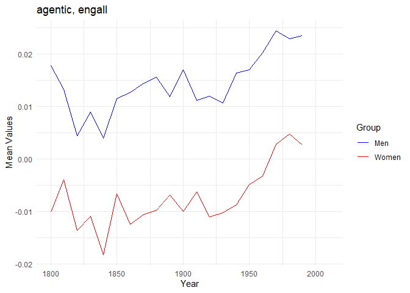<!-- -->

``` r
plot_one_ts(get_ts("nonhuman", "women", "agentic", "coha"))
```

    ## [Download Time Series](./csv_outputs/nonhuman_women_agentic_coha.csv)

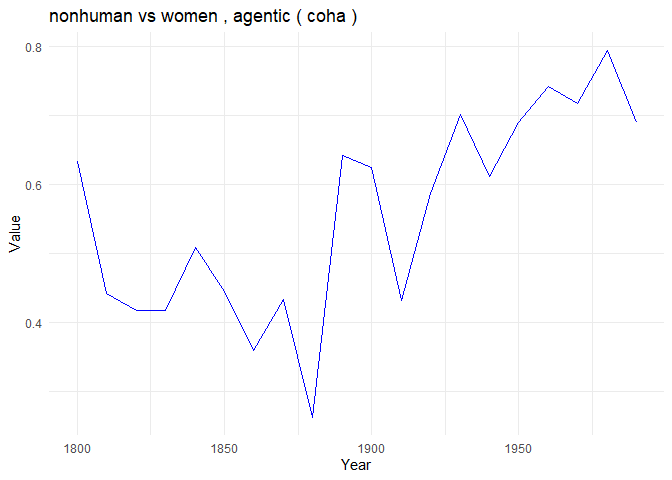<!-- -->

``` r
plot_one_ts(get_ts("nonhuman", "men", "communal", "coha"))
```

    ## [Download Time Series](./csv_outputs/nonhuman_men_communal_coha.csv)

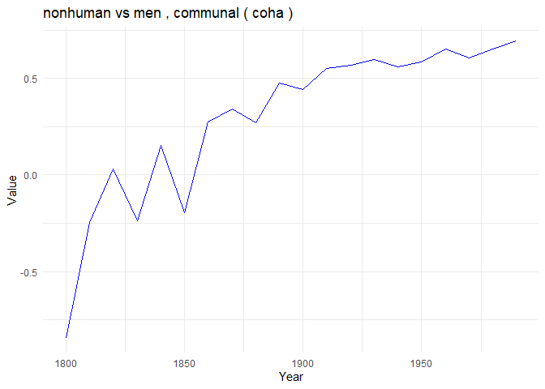<!-- -->

``` r
human_nonhuman_ts<-list(get_ts("nonhuman", "women", "trait", "coha"),get_ts("nonhuman", "men", "trait", "coha"), get_ts("nonhuman", "women", "trait", "engall"),get_ts("nonhuman", "men", "trait", "engall"),get_ts("men", "women", "trait", "engall"),get_ts("men", "women", "trait", "coha"))
```

    ## [Download Time Series](./csv_outputs/nonhuman_women_trait_coha.csv) 
    ## [Download Time Series](./csv_outputs/nonhuman_men_trait_coha.csv) 
    ## [Download Time Series](./csv_outputs/nonhuman_women_trait_engall.csv) 
    ## [Download Time Series](./csv_outputs/nonhuman_men_trait_engall.csv) 
    ## [Download Time Series](./csv_outputs/men_women_trait_engall.csv) 
    ## [Download Time Series](./csv_outputs/men_women_trait_coha.csv)

``` r
plot_multiple_ts(human_nonhuman_ts)
```

    ##     Year         Value   group1 group2 word_term corpus
    ## 1   1820 -0.5545055451 nonhuman  women     trait   coha
    ## 2   1830  0.4942465565 nonhuman  women     trait   coha
    ## 3   1840  0.3041416717 nonhuman  women     trait   coha
    ## 4   1850  0.3067780440 nonhuman  women     trait   coha
    ## 5   1860  0.3428107456 nonhuman  women     trait   coha
    ## 6   1870  0.3693959618 nonhuman  women     trait   coha
    ## 7   1880  0.2024482021 nonhuman  women     trait   coha
    ## 8   1890  0.2977310292 nonhuman  women     trait   coha
    ## 9   1900  0.2048898367 nonhuman  women     trait   coha
    ## 10  1910  0.5594166948 nonhuman  women     trait   coha
    ## 11  1920  0.5571861829 nonhuman  women     trait   coha
    ## 12  1930  0.4507095774 nonhuman  women     trait   coha
    ## 13  1940  0.5924398809 nonhuman  women     trait   coha
    ## 14  1950  0.6752322723 nonhuman  women     trait   coha
    ## 15  1960  0.6012015735 nonhuman  women     trait   coha
    ## 16  1970  0.6717925766 nonhuman  women     trait   coha
    ## 17  1980  0.6851925036 nonhuman  women     trait   coha
    ## 18  1990  0.6942313440 nonhuman  women     trait   coha
    ## 19  2000  0.7525918642 nonhuman  women     trait   coha
    ## 20  2010  0.5805283173 nonhuman  women     trait   coha
    ## 21  1820 -0.6270158701 nonhuman    men     trait   coha
    ## 22  1830 -0.0056851532 nonhuman    men     trait   coha
    ## 23  1840  0.2118993048 nonhuman    men     trait   coha
    ## 24  1850 -0.0628252607 nonhuman    men     trait   coha
    ## 25  1860  0.3771408114 nonhuman    men     trait   coha
    ## 26  1870 -0.0028123320 nonhuman    men     trait   coha
    ## 27  1880  0.4872676732 nonhuman    men     trait   coha
    ## 28  1890  0.5111579739 nonhuman    men     trait   coha
    ## 29  1900  0.4500657151 nonhuman    men     trait   coha
    ## 30  1910  0.5048993160 nonhuman    men     trait   coha
    ## 31  1920  0.5397125436 nonhuman    men     trait   coha
    ## 32  1930  0.5945751480 nonhuman    men     trait   coha
    ## 33  1940  0.5885747565 nonhuman    men     trait   coha
    ## 34  1950  0.6474528962 nonhuman    men     trait   coha
    ## 35  1960  0.5240582903 nonhuman    men     trait   coha
    ## 36  1970  0.5840077017 nonhuman    men     trait   coha
    ## 37  1980  0.6763061916 nonhuman    men     trait   coha
    ## 38  1990  0.6507539628 nonhuman    men     trait   coha
    ## 39  2000  0.6308608099 nonhuman    men     trait   coha
    ## 40  2010  0.6221948248 nonhuman    men     trait   coha
    ## 41  1800 -0.1433551875 nonhuman  women     trait engall
    ## 42  1810  0.0394563422 nonhuman  women     trait engall
    ## 43  1820  0.0450631233 nonhuman  women     trait engall
    ## 44  1830 -0.0653760991 nonhuman  women     trait engall
    ## 45  1840 -0.1682031133 nonhuman  women     trait engall
    ## 46  1850 -0.1083602823 nonhuman  women     trait engall
    ## 47  1860 -0.1628964863 nonhuman  women     trait engall
    ## 48  1870 -0.2155408609 nonhuman  women     trait engall
    ## 49  1880 -0.2573501882 nonhuman  women     trait engall
    ## 50  1890 -0.2539468255 nonhuman  women     trait engall
    ## 51  1900 -0.2298125126 nonhuman  women     trait engall
    ## 52  1910 -0.1465882323 nonhuman  women     trait engall
    ## 53  1920 -0.1113527747 nonhuman  women     trait engall
    ## 54  1930 -0.1004072681 nonhuman  women     trait engall
    ## 55  1940  0.0598169626 nonhuman  women     trait engall
    ## 56  1950  0.0004823408 nonhuman  women     trait engall
    ## 57  1960  0.1979855061 nonhuman  women     trait engall
    ## 58  1970  0.2179954340 nonhuman  women     trait engall
    ## 59  1980  0.2438182812 nonhuman  women     trait engall
    ## 60  1990  0.0467273015 nonhuman  women     trait engall
    ## 61  1800 -0.1744124748 nonhuman    men     trait engall
    ## 62  1810  0.0142392567 nonhuman    men     trait engall
    ## 63  1820  0.0157077123 nonhuman    men     trait engall
    ## 64  1830 -0.0891944274 nonhuman    men     trait engall
    ## 65  1840 -0.2270850538 nonhuman    men     trait engall
    ## 66  1850 -0.2756924627 nonhuman    men     trait engall
    ## 67  1860 -0.2502505959 nonhuman    men     trait engall
    ## 68  1870 -0.2974012267 nonhuman    men     trait engall
    ## 69  1880 -0.3606907036 nonhuman    men     trait engall
    ## 70  1890 -0.4125732971 nonhuman    men     trait engall
    ## 71  1900 -0.3055454455 nonhuman    men     trait engall
    ## 72  1910 -0.2282564013 nonhuman    men     trait engall
    ## 73  1920 -0.1610690049 nonhuman    men     trait engall
    ## 74  1930 -0.2200333364 nonhuman    men     trait engall
    ## 75  1940 -0.0217683282 nonhuman    men     trait engall
    ## 76  1950 -0.0509809357 nonhuman    men     trait engall
    ## 77  1960  0.0832708176 nonhuman    men     trait engall
    ## 78  1970  0.1182129891 nonhuman    men     trait engall
    ## 79  1980  0.2245354052 nonhuman    men     trait engall
    ## 80  1990  0.0170758118 nonhuman    men     trait engall
    ## 81  1800  0.7465133788      men  women     trait engall
    ## 82  1810  0.7162459763      men  women     trait engall
    ## 83  1820  0.7252543975      men  women     trait engall
    ## 84  1830  0.7399759769      men  women     trait engall
    ## 85  1840  0.7489612826      men  women     trait engall
    ## 86  1850  0.7321367158      men  women     trait engall
    ## 87  1860  0.7264995732      men  women     trait engall
    ## 88  1870  0.7860329339      men  women     trait engall
    ## 89  1880  0.8091151484      men  women     trait engall
    ## 90  1890  0.8062662300      men  women     trait engall
    ## 91  1900  0.8376657221      men  women     trait engall
    ## 92  1910  0.8863795547      men  women     trait engall
    ## 93  1920  0.8596792010      men  women     trait engall
    ## 94  1930  0.8695002053      men  women     trait engall
    ## 95  1940  0.8798144194      men  women     trait engall
    ## 96  1950  0.8975192140      men  women     trait engall
    ## 97  1960  0.9137856358      men  women     trait engall
    ## 98  1970  0.9324681883      men  women     trait engall
    ## 99  1980  0.9303790709      men  women     trait engall
    ## 100 1990  0.9402086691      men  women     trait engall
    ## 101 1820  0.7622319807      men  women     trait   coha
    ## 102 1830  0.5183823734      men  women     trait   coha
    ## 103 1840  0.6604560103      men  women     trait   coha
    ## 104 1850  0.5940544320      men  women     trait   coha
    ## 105 1860  0.6368320711      men  women     trait   coha
    ## 106 1870  0.6650215914      men  women     trait   coha
    ## 107 1880  0.6705379614      men  women     trait   coha
    ## 108 1890  0.7596321104      men  women     trait   coha
    ## 109 1900  0.6725894466      men  women     trait   coha
    ## 110 1910  0.8437228821      men  women     trait   coha
    ## 111 1920  0.9176070031      men  women     trait   coha
    ## 112 1930  0.8981021862      men  women     trait   coha
    ## 113 1940  0.9292607066      men  women     trait   coha
    ## 114 1950  0.9371413015      men  women     trait   coha
    ## 115 1960  0.9101348625      men  women     trait   coha
    ## 116 1970  0.9344243787      men  women     trait   coha
    ## 117 1980  0.9454345899      men  women     trait   coha
    ## 118 1990  0.9576827651      men  women     trait   coha
    ## 119 2000  0.9548407391      men  women     trait   coha
    ## 120 2010  0.9629704694      men  women     trait   coha

    ## Warning: Removed 3 rows containing missing values (`geom_line()`).

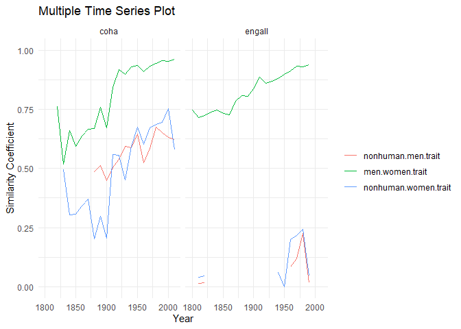<!-- -->

``` r
plot_one_decade(get_decade("nonhuman", "women", "trait", "coha", 2010))
```

    ## Warning: Removed 244 rows containing non-finite values (`stat_smooth()`).

    ## Warning: Removed 244 rows containing missing values (`geom_point()`).

    ## Warning: Removed 244 rows containing missing values (`geom_text()`).

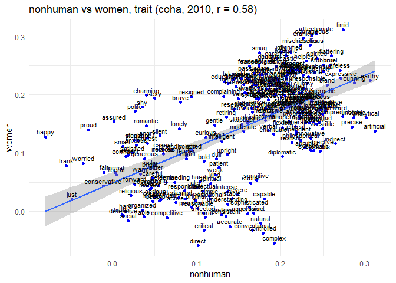<!-- -->
