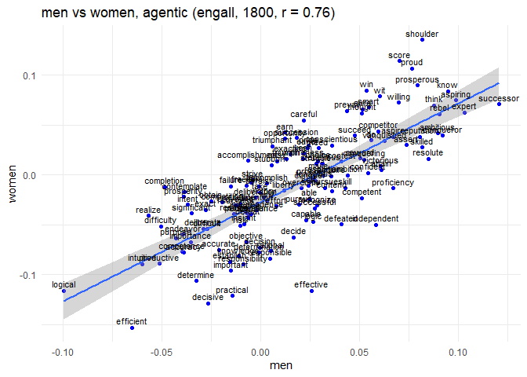
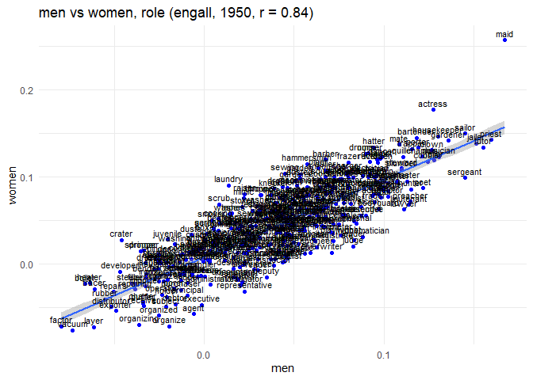
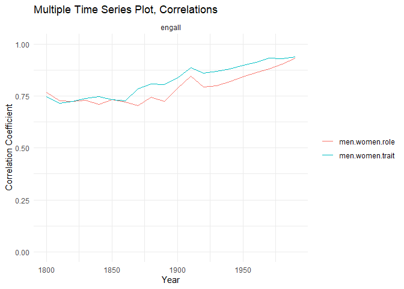
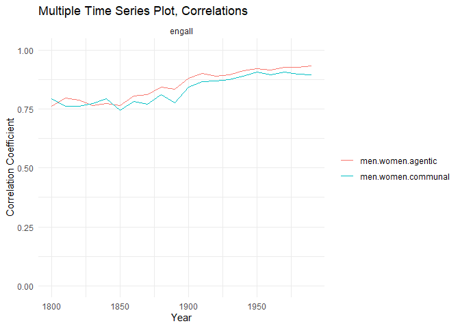

[Visit the original repository on
GitHub](https://github.com/nelariddle/histembeddingsgender)

We load in the required packages.

### Setup

First, load in the pre-written group and word lists to be used in
analyses. We are creating a custom function for reading in the word
lists. It assumes no headers and single vector of words.

Then, we pull in the group words and trait/role words files file and
doing some basic cleaning.

    ## Load in data ----
    ## Set WD to word stimuli
    setwd("wordstim")

    # Function to read and process lists
    read_list <- function(file, col_name) {
      list_data <- read.delim(file, header = FALSE)
      colnames(list_data) <- col_name
      return(as.vector(list_data[[col_name]]))
    }

    # Specific groups (men, women)
    groupwrds <- read.csv("groupstimlists.csv", header = FALSE)
    groupwrds <- as.data.frame(t(groupwrds))
    colnames(groupwrds) <- as.character(groupwrds[1, ])
    groupwrds <- groupwrds[-1, ]

    # Read lists using the function
    agentic <- read_list("agentic.txt", "agentic")
    communal <- read_list("communal.txt", "communal")
    trait <- read_list("traitlist.txt", "trait")
    chore <- read_list("chore.txt", "chore")
    role <- read_list("joblistDOT.txt", "role")
    role2 <-
      sub("s$", "", tolower(
        read.csv(
          "All_Occupations.csv",
          header = TRUE,
          stringsAsFactors = FALSE
        )$Occupation[!grepl(
          "\\s",
          read.csv(
            "All_Occupations.csv",
            header = TRUE,
            stringsAsFactors = FALSE
          )$Occupation
        )]
      ))
    role <- union(role, role2)
    role <- union(role, chore)

    noun <- read_list("nouns.txt", "noun")
    common <- read_list("common.txt", "common")

    setwd("..")

The agentic and communal lists were borrowed from
<https://onlinelibrary.wiley.com/doi/10.1002/ejsp.2561>; here are some
examples:

    head(agentic)

    ## [1] "able"           "accomplish"     "accomplishment" "accuracy"      
    ## [5] "accurate"       "achieve"

    head(communal)

    ## [1] "accept"        "acceptable"    "acceptance"    "accommodate"  
    ## [5] "accommodation" "accompany"

The group word lists were taken from
<https://pubmed.ncbi.nlm.nih.gov/35787033/>, as well as the trait list:

    head(groupwrds$men)

    ## [1] "men"         "man"         "male"        "males"       "masculine"  
    ## [6] "masculinity"

    head(groupwrds$women)

    ## [1] "women"      "woman"      "female"     "females"    "feminine"  
    ## [6] "femininity"

    head(trait)

    ## [1] "able"          "abrupt"        "absentminded"  "abusive"      
    ## [5] "accommodating" "accurate"

The role titles were scraped off this site:
<https://theodora.com/dot_index.html>, a 1971 survey on role titles.
They were merged with one-word titles from ONET, the modern equivalent:
<https://www.onetonline.org/find/all>. They were merged with the chore
list to represent unpaid labor.

    ## [1] "referee"     "wirer"       "stoneworker" "doweler"     "clerk"      
    ## [6] "boiler"

Now, we define which words are not available in both sets of embeddings
across time.

This was a decision made by the original folks who trained these
embeddings (histwords) “Furthermore, the authors only computed
embeddings for words that were among the top 100,000 most frequent words
over all time (for EngAll) or top 50,000 most frequent words (for COHA),
and further discarded any words that occurred less than 500 times (for
EngAll) or 100 times (for COHA) in a given decade.”

### Producing the mac scores

The workhorse function, which iterates over each decade, computing the
MAC (mean average cosine similarity) score between each word and each
group, then finds the Pearson correlation of the resulting lists
(demonstrated visually later).

    grpwrdassoc_rel <-
      function(group1index,
               group2index,
               wordterms,
               wordvecs.dat = wordvecs.dat,
               unavwords = unavwords,
               corpus) {
        start_year <- if (corpus == "coha")
          1810
        else
          1800
        end_year <- if (corpus == "coha")
          2000
        else
          1990
        
        # Create lists of the group's available words
        availwrds_decade_group1 <-
          lapply(1:length(wordvecs.dat), function(i) {
            groupwrds[, group1index][groupwrds[, group1index] != "" &
                                       !groupwrds[, group1index] %in% unavwords[[i]]]
          })
        
        availwrds_decade_group2 <-
          lapply(1:length(wordvecs.dat), function(i) {
            groupwrds[, group2index][groupwrds[, group2index] != "" &
                                       !groupwrds[, group2index] %in% unavwords[[i]]]
          })
        
        availwrds_decade_wordterms <-
          lapply(1:length(wordvecs.dat), function(i) {
            wordterms[!wordterms %in% unavwords[[i]]]
          })
        
        # Now compute MAC from available words for each decade
        wordvecs.mat <- list()
        mac_group1_2list <- list()
        cor_group1_2 <- list()
        cor_group1_2ts <- vector()
        for (i in 1:length(wordvecs.dat)) {
          wordvecs.mat[[i]] <- as.matrix(wordvecs.dat[[i]])
          
          mac_group1_2list[[i]] <-
            data.frame(
              grp1ef = mac(wordvecs.mat[[i]], S = wordterms, A = availwrds_decade_group1[[i]])$P,
              grp2ef = mac(wordvecs.mat[[i]], S = wordterms, A = availwrds_decade_group2[[i]])$P,
              trait = names(
                mac(wordvecs.mat[[i]], S = wordterms, A = availwrds_decade_group1[[i]])$P
              )
            )
          
          # requires 2 data points; occasionally early COHA doesn't have enough, so replace with NA
          cor_group1_2[[i]] <- tryCatch({
            cor.test(mac_group1_2list[[i]]$grp2ef, mac_group1_2list[[i]]$grp1ef)
          },
          error = function(e)
            NA)
          
          cor_group1_2ts[i] <- if (is.list(cor_group1_2[[i]])) {
            cor_group1_2[[i]]$estimate
          } else {
            NA
          }
          
          cor_group1_2ts <-
            ts(
              cor_group1_2ts,
              start = start_year,
              end = end_year,
              frequency = 1 / 10
            )
          print(i)
        }
        output_rel <- list(mac_group1_2list,
                           cor_group1_2ts)
        return(output_rel)
      }

An example of how the mac function works (using engall 1990); here we
compute the mean average correlation of each word in the first list to
the list of animals. It makes sense that the animals in the first list
had the highest mac score.

    print(mac(
      as.matrix(wordvecs.dat[[20]]),
      S = c("elephant", "horse", "tiger", "happy", "weird", "car"),
      A = c("dog", "cat", "turtle", "fish", "monkey") # the "group" words
    )$P)

    ##   elephant      horse      tiger      happy      weird        car 
    ## 0.29825993 0.26152604 0.32429946 0.01836855 0.12177856 0.09239695

You can compute the cosine similarity of any two words by replacing the
lists with single words.

    print(mac(
      as.matrix(wordvecs.dat[[20]]),
      S = "happy",
      A = "sad"
    )$P)

    ##     happy 
    ## 0.4395598

We can also see a MAC score for an association across decades.

    plot(unlist(lapply(1:20, function(i) mac(as.matrix(wordvecs.dat[[i]]), S = "teacher", A = "woman")$P)))

Now, we will create some helper functions, starting with creating an
empty dataframe to be filled in.

This custom function is built for our research question. It takes two
sets of group words (e.g., man and woman words), a set of word terms
(e.g., agency), and a corpus term (i.e., to define either engall or
coha). It then calls the above workhorse function, computing the cosine
similarities and then the higher-order correlations i.e.,
grpwrdassoc\_rel

The get\_data\_internal function can be flexibly called for the whole
time period or for a specific decade, converting into an
easier-to-work-with dataframe.

The get\_ts and get\_decade functions are just simple-use wrappers for
the above function. This likely helps to prevent mistakes.

Now, we test everything we have so far.

Now, we are creating functions for dynamic visualizations.

### Looking at a decade

We can plot the mac scores for two different groups against each other
like so.

The correlation between men-agentic and women-agentic cosine
similarities in coha in 1810.

    plot_one_decade(get_decade("men", "women", "agentic", "coha", 1810))

    plot_one_decade(get_decade("men", "women", "agentic", "engall", 1800))

    plot_one_decade(get_decade("men", "women", "role", "engall", 1950))

The titles of the plots contain the Pearson coefficient, which is what
we will use to measure the similarity of the two groups.

### Outlier analysis

Noticing that the 1810 coha plot had an odd correlation, let’s check the
proportion of gender words that were available, as this could be skewing
the slope.

    # Calculate the number of missing group words by decade
    groupmiss_coha <-
      as.data.frame(sapply(1:dim(groupwrds)[2], function(j) {
        sapply(1:length(wordvecs.dat_coha), function(i) {
          sum(groupwrds[, j] %in% unavwords_coha[[i]])
        })
      }))
    colnames(groupmiss_coha) <- colnames(groupwrds)
    groupmiss_coha[21,] <- colSums(groupwrds != "", na.rm = TRUE)
    groupmiss2_coha <-
      as.data.frame(sapply(1:dim(groupmiss_coha)[2], function(j) {
        1 - groupmiss_coha[1:20, j] / groupmiss_coha[21, j]
      }))
    colnames(groupmiss2_coha) <- colnames(groupwrds)

    # Add the year column
    rownames(groupmiss2_coha) <- seq(1810, 2000, by = 10)
    groupmiss2_coha$year <- seq(1810, 2000, by = 10)
    groupmiss2_coha

    ##            men     women     human  nonhuman year
    ## 1810 0.4242424 0.3714286 0.5000000 0.1111111 1810
    ## 1820 0.5757576 0.5714286 0.6428571 0.4444444 1820
    ## 1830 0.6969697 0.6571429 0.6428571 0.6111111 1830
    ## 1840 0.6666667 0.6857143 0.6428571 0.6111111 1840
    ## 1850 0.6969697 0.7142857 0.6428571 0.6666667 1850
    ## 1860 0.6969697 0.7142857 0.7142857 0.6666667 1860
    ## 1870 0.6969697 0.6857143 0.8571429 0.6111111 1870
    ## 1880 0.7272727 0.7142857 0.9285714 0.7222222 1880
    ## 1890 0.7575758 0.6857143 0.9285714 0.6111111 1890
    ## 1900 0.7272727 0.7428571 0.9285714 0.7222222 1900
    ## 1910 0.7878788 0.7428571 0.9285714 0.6111111 1910
    ## 1920 0.8181818 0.6857143 1.0000000 0.7222222 1920
    ## 1930 0.8181818 0.7142857 0.9285714 0.7222222 1930
    ## 1940 0.8181818 0.7142857 0.9285714 0.7222222 1940
    ## 1950 0.7575758 0.7142857 1.0000000 0.8333333 1950
    ## 1960 0.7575758 0.6857143 1.0000000 0.8888889 1960
    ## 1970 0.7878788 0.6571429 1.0000000 0.8888889 1970
    ## 1980 0.7272727 0.6857143 1.0000000 0.8333333 1980
    ## 1990 0.6969697 0.7142857 1.0000000 0.8888889 1990
    ## 2000 0.7575758 0.7142857 1.0000000 0.8333333 2000

    # Create the plot
    ggplot(groupmiss2_coha, aes(x = year)) +
      geom_line(aes(y = men, color = "Men")) +
      geom_line(aes(y = women, color = "Women")) +
      scale_color_manual(values = c("Men" = "blue", "Women" = "red")) +
      labs(title = "prop. group words available over time (coha)",
           x = "Years",
           y = "Values",
           color = "Legend") +
      theme_minimal()

Clearly many fewer words were available in that first decade; let’s
check for statistical outliers.

    find_outliers <- function(column, year) {
      is_outlier <-
        abs(column - mean(column, na.rm = TRUE)) > 3 * sd(column, na.rm = TRUE)
      data.frame(Decade = year[is_outlier], Value = column[is_outlier])
    }

    # Find outliers for men and women
    outliers_men <-
      find_outliers(groupmiss2_coha$men, groupmiss2_coha$year)
    outliers_women <-
      find_outliers(groupmiss2_coha$women, groupmiss2_coha$year)

    # Print results
    outliers_men

    ##   Decade     Value
    ## 1   1810 0.4242424

    outliers_women

    ##   Decade     Value
    ## 1   1810 0.3714286

Repeat for engall:

    # Calculate the number of missing group words by decade
    groupmiss <-
      as.data.frame(sapply(1:dim(groupwrds)[2], function(j) {
        sapply(1:length(wordvecs.dat), function(i) {
          sum(groupwrds[, j] %in% unavwords[[i]])
        })
      }))
    colnames(groupmiss) <- colnames(groupwrds)
    groupmiss[21,] <- colSums(groupwrds != "", na.rm = TRUE)
    groupmiss2 <-
      as.data.frame(sapply(1:dim(groupmiss)[2], function(j) {
        1 - groupmiss[1:20, j] / groupmiss[21, j]
      }))
    colnames(groupmiss2) <- colnames(groupwrds)

    # Add the year column
    rownames(groupmiss2) <- seq(1800, 1990, by = 10)
    groupmiss2$year <- seq(1800, 1990, by = 10)
    groupmiss2

    ##            men     women     human  nonhuman year
    ## 1800 0.7272727 0.6571429 0.6428571 0.5555556 1800
    ## 1810 0.7575758 0.7142857 0.7142857 0.6111111 1810
    ## 1820 0.7878788 0.8000000 0.7142857 0.6111111 1820
    ## 1830 0.7878788 0.8000000 0.7142857 0.6111111 1830
    ## 1840 0.7878788 0.8285714 0.7142857 0.7777778 1840
    ## 1850 0.7878788 0.8285714 0.8571429 0.7777778 1850
    ## 1860 0.7878788 0.8285714 0.8571429 0.7777778 1860
    ## 1870 0.7878788 0.8000000 0.9285714 0.8333333 1870
    ## 1880 0.8484848 0.8857143 0.9285714 0.8333333 1880
    ## 1890 0.8484848 0.9142857 0.9285714 0.8333333 1890
    ## 1900 0.8484848 0.9142857 0.9285714 0.8333333 1900
    ## 1910 0.8787879 0.8571429 1.0000000 0.8333333 1910
    ## 1920 0.8484848 0.8857143 1.0000000 0.8333333 1920
    ## 1930 0.8484848 0.8285714 1.0000000 0.8333333 1930
    ## 1940 0.8484848 0.8285714 1.0000000 0.8333333 1940
    ## 1950 0.8787879 0.8857143 1.0000000 0.8333333 1950
    ## 1960 0.9090909 0.9428571 1.0000000 0.9444444 1960
    ## 1970 0.9393939 0.9428571 1.0000000 1.0000000 1970
    ## 1980 0.9696970 0.9714286 1.0000000 1.0000000 1980
    ## 1990 1.0000000 1.0000000 1.0000000 1.0000000 1990

    # Create the plot
    ggplot(groupmiss2, aes(x = year)) +
      geom_line(aes(y = men, color = "Men")) +
      geom_line(aes(y = women, color = "Women")) +
      scale_color_manual(values = c("Men" = "blue", "Women" = "red")) +
      labs(title = "prop. group words available over time (engall)",
           x = "Years",
           y = "Values",
           color = "Legend") +
      theme_minimal()

    # Find outliers for men and women
    outliers_men <-
      find_outliers(groupmiss2$men, groupmiss2_coha$year)
    outliers_women <-
      find_outliers(groupmiss2$women, groupmiss2_coha$year)

    # Print results
    outliers_men

    ## [1] Decade Value 
    ## <0 rows> (or 0-length row.names)

    outliers_women

    ## [1] Decade Value 
    ## <0 rows> (or 0-length row.names)

Engall has no outliers, as expected.

### Plots, engall

Now we can begin to plot the actual correlation values over time,
starting with engall:

    men_women_trait_role_ts <-
      list(
        get_ts("men", "women", "trait", "engall"),
        get_ts("men", "women", "role", "engall")
      )
    plot_multiple_ts(men_women_trait_role_ts)

    men_women_agentic_communal_ts <-
      list(
        get_ts("men", "women", "agentic", "engall"),
        get_ts("men", "women", "communal", "engall")
      )
    plot_multiple_ts(men_women_agentic_communal_ts)

Now, let’s look at the actual magnitudes of the mac scores (rather than
the Pearson correlations). To do this, we take the mean of all mac
scores with a single group.

    men_women_trait_role_ts <-
      list(
        get_ts_averages("men", "agentic", "engall"),
        get_ts_averages("men", "communal", "engall"),
        get_ts_averages("women", "agentic", "engall"),
        get_ts_averages("women", "communal", "engall")
      )
    plot_multiple_ts_averages(men_women_trait_role_ts)

### Baseline with nonhuman groups

We can also do a baseline test with different groups to see if the
men/women correlations are uniquely high.

    human_nonhuman_ts <-
      list(
        get_ts("nonhuman", "women", "trait", "coha"),
        get_ts("nonhuman", "men", "trait", "coha"),
        get_ts("nonhuman", "women", "trait", "engall"),
        get_ts("nonhuman", "men", "trait", "engall"),
        get_ts("men", "women", "trait", "engall"),
        get_ts("men", "women", "trait", "coha")
      )
    plot_multiple_ts(human_nonhuman_ts)

    plot_one_decade(get_decade("nonhuman", "women", "trait", "engall", 1980))

    plot_one_decade(get_decade("nonhuman", "men", "trait", "coha", 1980))

### Plots, coha

    men_women_trait_role_ts <-
      list(
        get_ts("men", "women", "trait", "coha"),
        get_ts("men", "women", "role", "coha")
      )
    plot_multiple_ts(men_women_trait_role_ts)

    men_women_agentic_communal_ts <-
      list(
        get_ts("men", "women", "agentic", "coha"),
        get_ts("men", "women", "communal", "coha")
      )
    plot_multiple_ts(men_women_agentic_communal_ts)

    men_women_trait_role_ts <-
      list(
        get_ts_averages("men", "agentic", "coha"),
        get_ts_averages("men", "communal", "coha"),
        get_ts_averages("women", "agentic", "coha"),
        get_ts_averages("women", "communal", "coha")
      )
    plot_multiple_ts_averages(men_women_trait_role_ts)

### Data in excel format

Access the files containing all the data, which can be filtered in
excel:

    head(overall_results)

    ##   year     value group1index group2index wordterms corpus
    ## 1 1800 0.7608427         men       women   agentic engall
    ## 2 1810 0.7966443         men       women   agentic engall
    ## 3 1820 0.7896832         men       women   agentic engall
    ## 4 1830 0.7644530         men       women   agentic engall
    ## 5 1840 0.7750871         men       women   agentic engall
    ## 6 1850 0.7651039         men       women   agentic engall

    write_xlsx(overall_results, "overall_results.xlsx")

[overall\_results.xlsx](overall_results.xlsx)

    head(overall_results_averages)

    ##   year       value group1index wordterms corpus
    ## 1 1800 0.017776823         men   agentic engall
    ## 2 1810 0.013167537         men   agentic engall
    ## 3 1820 0.004411563         men   agentic engall
    ## 4 1830 0.008945463         men   agentic engall
    ## 5 1840 0.003948094         men   agentic engall
    ## 6 1850 0.011462237         men   agentic engall

    write_xlsx(overall_results_averages, "overall_results_averages.xlsx")

[overall\_results\_averages.xlsx](overall_results_averages.xlsx)

### Plots, engall+coha

    men_women_trait_role_ts <-
      list(
        get_ts("men", "women", "trait", "engall"),
        get_ts("men", "women", "role", "engall"),
        get_ts("men", "women", "trait", "coha"),
        get_ts("men", "women", "role", "coha")
      )
    plot_multiple_ts(men_women_trait_role_ts)

    men_women_agentic_communal_ts <-
      list(
        get_ts("men", "women", "agentic", "engall"),
        get_ts("men", "women", "communal", "engall"),
        get_ts("men", "women", "agentic", "coha"),
        get_ts("men", "women", "communal", "coha")
      )
    plot_multiple_ts(men_women_agentic_communal_ts)

### Analysis of word count by gender

First, the raw counts can be viewed here:

[gender\_word\_counts.csv](gender_word_counts.csv)

[gender\_word\_counts\_genre\_aggregated.csv](gender_word_counts_genre_aggregated.csv)

The data was generated through a python script that collected counts
from the original text. Here is a preview:

    ##   genre decade gender      word count
    ## 1  acad   1820   male    blokes     0
    ## 2  acad   1820   male   himself   847
    ## 3  acad   1820   male masculine     3
    ## 4  acad   1820   male       man  1569
    ## 5  acad   1820   male      guys     0
    ## 6  acad   1820   male       men  1706

    ##   decade   word gender count
    ## 1   1820  bloke   male     0
    ## 2   1820 blokes   male     0
    ## 3   1820    boy   male  1080
    ## 4   1820   boys   male   367
    ## 5   1820  bride female   146
    ## 6   1820 brides female    10

We also have access to the overall counts for each COHA decade in order
to contextualize those for the gender words. They were acquired from
<https://www.english-corpora.org/coha/>.

    coha_counts <- read.csv("overall_counts.csv")

    head(coha_counts)

    ##   DECADE TV.MOVIES  FICTION POPULARMAGAZINES NEWSPAPERS NON.FICTIONBOOKS
    ## 1  1820s        NA  3778554          1730991         NA          1471844
    ## 2  1830s        NA  7492464          3158784         NA          3060039
    ## 3  1840s        NA  8615569          3584996         NA          3606482
    ## 4  1850s        NA  9175764          4243240         NA          3116999
    ## 5  1860s        NA  9279356          4469061     264549          2923594
    ## 6  1870s        NA 10454445          4489558    1037506          2806958
    ##      TOTAL X..FICTION X..FIC..TV.MOV.
    ## 1  6981389      54.1%           54.1%
    ## 2 13711287      54.6%           54.6%
    ## 3 15807047      54.5%           54.5%
    ## 4 16536003      55.5%           55.5%
    ## 5 16936560      54.8%           54.8%
    ## 6 18788467      55.6%           55.6%

Some have NA because genres TV and news weren’t collected until later
years.

We reshape it into tidy data like so:

    library(tidyr)
    library(tidyverse)

    ## Warning: package 'tidyverse' was built under R version 4.3.3

    ## Warning: package 'forcats' was built under R version 4.3.3

    ## Warning: package 'lubridate' was built under R version 4.3.3

    ## ── Attaching core tidyverse packages ────────────────────────────────────────────────────── tidyverse 2.0.0 ──
    ## ✔ forcats   1.0.0     ✔ readr     2.1.4
    ## ✔ lubridate 1.9.3     ✔ stringr   1.5.0
    ## ✔ purrr     1.0.1     ✔ tibble    3.2.1
    ## ── Conflicts ──────────────────────────────────────────────────────────────────────── tidyverse_conflicts() ──
    ## ✖ dplyr::filter() masks stats::filter()
    ## ✖ dplyr::lag()    masks stats::lag()
    ## ℹ Use the ]8;;http://conflicted.r-lib.org/conflicted package]8;; to force all conflicts to become errors

    genre_map <-
      c(
        "NON.FICTIONBOOKS" = "acad",
        "FICTION" = "fic",
        "POPULARMAGAZINES" = "mag",
        "NEWSPAPERS" = "news",
        "TV.MOVIES" = "tvm"
      )

    coha_counts_tidy <- coha_counts %>%
      slice(1:(n() - 1)) %>%
      pivot_longer(
        cols = names(coha_counts)[-c(1, (ncol(coha_counts) - 2):ncol(coha_counts))],
        names_to = "genre",
        values_to = "count"
      ) %>%
      mutate(decade = as.integer(str_remove(DECADE, "s$")),
             genre = recode(genre,!!!genre_map)) %>%
      select(decade, genre, count)

    coha_counts_tidy

    ## # A tibble: 100 × 3
    ##    decade genre   count
    ##     <int> <chr>   <int>
    ##  1   1820 tvm        NA
    ##  2   1820 fic   3778554
    ##  3   1820 mag   1730991
    ##  4   1820 news       NA
    ##  5   1820 acad  1471844
    ##  6   1830 tvm        NA
    ##  7   1830 fic   7492464
    ##  8   1830 mag   3158784
    ##  9   1830 news       NA
    ## 10   1830 acad  3060039
    ## # ℹ 90 more rows

    coha_counts_genre_aggregated <-
      coha_counts_tidy %>%  group_by(decade) %>% summarise(count = sum(count, na.rm = TRUE))

    coha_counts_genre_aggregated

    ## # A tibble: 20 × 2
    ##    decade    count
    ##     <int>    <int>
    ##  1   1820  6981389
    ##  2   1830 13711287
    ##  3   1840 15807047
    ##  4   1850 16536003
    ##  5   1860 16936560
    ##  6   1870 18788467
    ##  7   1880 20067205
    ##  8   1890 20426783
    ##  9   1900 21977250
    ## 10   1910 23103098
    ## 11   1920 25700422
    ## 12   1930 27707879
    ## 13   1940 27399750
    ## 14   1950 28661274
    ## 15   1960 29122676
    ## 16   1970 28829225
    ## 17   1980 29851580
    ## 18   1990 33149318
    ## 19   2000 34821812
    ## 20   2010 35452806

Now we can find the relative frequency of each term within a decade.

    gender_word_frequencies <-
      gender_word_counts_genre_aggregated %>% merge(coha_counts_genre_aggregated,
                                                    by.x = "decade",
                                                    by.y = "decade") %>% mutate(prop = count.x / count.y) %>% select(decade, word, gender, prop)

    head(gender_word_frequencies)

    ##   decade   word gender         prop
    ## 1   1820  bloke   male 0.000000e+00
    ## 2   1820 blokes   male 0.000000e+00
    ## 3   1820    boy   male 1.546970e-04
    ## 4   1820   boys   male 5.256834e-05
    ## 5   1820  bride female 2.091274e-05
    ## 6   1820 brides female 1.432380e-06

We can also aggregate the words by gender:

    gender_frequencies <-
      gender_word_frequencies %>% group_by(gender, decade) %>% summarize(prop =
                                                                           sum(prop))

    ## `summarise()` has grouped output by 'gender'. You can override using the
    ## `.groups` argument.

    head(gender_frequencies)

    ## # A tibble: 6 × 3
    ## # Groups:   gender [1]
    ##   gender decade    prop
    ##   <chr>   <int>   <dbl>
    ## 1 female   1820 0.0104 
    ## 2 female   1830 0.00834
    ## 3 female   1840 0.00860
    ## 4 female   1850 0.0115 
    ## 5 female   1860 0.0124 
    ## 6 female   1870 0.0151

    gender_frequencies %>% ggplot(aes(x = decade, y = prop, color = gender)) +
      geom_point()+ggtitle("Proportion of COHA represented by gender categories")

An analysis by genre, just for fun:

    gender_word_frequencies_by_genre <-
      gender_word_counts %>% merge(coha_counts_tidy,
                                                    by.x = c("decade", "genre"),
                                                    by.y = c("decade","genre")) %>% mutate(prop = count.x / count.y) %>% select(decade, genre, word, gender, prop)

    head(gender_word_frequencies_by_genre)

    ##   decade genre      word gender         prop
    ## 1   1820  acad    blokes   male 0.000000e+00
    ## 2   1820  acad   himself   male 5.754686e-04
    ## 3   1820  acad masculine   male 2.038259e-06
    ## 4   1820  acad       man   male 1.066010e-03
    ## 5   1820  acad      guys   male 0.000000e+00
    ## 6   1820  acad       men   male 1.159090e-03

Meaning, in 1820, “men” represented about 1.15e-3 of the acad genre.

    gender_frequencies_by_genre <-
      gender_word_frequencies_by_genre %>% group_by(decade, gender, genre) %>% summarise(prop =
                                                                                           sum(prop))

    ## `summarise()` has grouped output by 'decade', 'gender'. You can override using
    ## the `.groups` argument.

    head(gender_frequencies_by_genre)

    ## # A tibble: 6 × 4
    ## # Groups:   decade, gender [2]
    ##   decade gender genre    prop
    ##    <int> <chr>  <chr>   <dbl>
    ## 1   1820 female acad  0.00324
    ## 2   1820 female fic   0.0168 
    ## 3   1820 female mag   0.00227
    ## 4   1820 male   acad  0.0186 
    ## 5   1820 male   fic   0.0318 
    ## 6   1820 male   mag   0.0200

    gender_frequencies_by_genre %>% ggplot(aes(x = decade, y = prop, color = gender)) +
      geom_point() + facet_wrap(vars(genre))+ggtitle("Proportion of genres in COHA by gender")

    ## 
    ## Attaching package: 'scales'

    ## The following object is masked from 'package:purrr':
    ## 
    ##     discard

    ## The following object is masked from 'package:readr':
    ## 
    ##     col_factor

    ## Rows: 5780 Columns: 5
    ## ── Column specification ──────────────────────────────────────────────────────────────────────────────────────
    ## Delimiter: ","
    ## chr (3): genre, gender, word
    ## dbl (2): decade, count
    ## 
    ## ℹ Use `spec()` to retrieve the full column specification for this data.
    ## ℹ Specify the column types or set `show_col_types = FALSE` to quiet this message.
