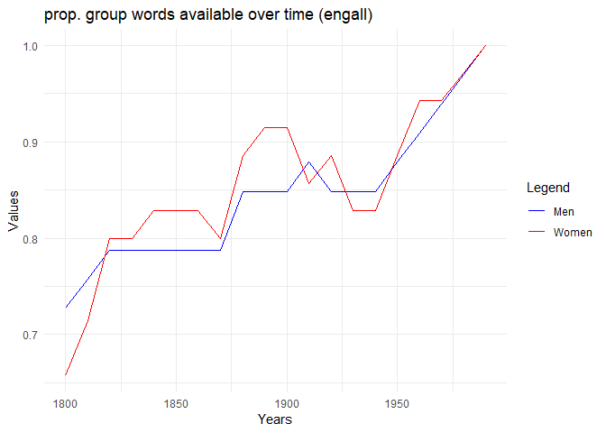

Tran_Riddle_Historical Embeddings
================
Nela Riddle
December 3, 2024

First, load in the pre-written group and word lists to be used in
analyses:

``` r
## Load in data ----
## Set WD to word stimuli
setwd("wordstim")

# Function to read and process lists
read_list <- function(file, col_name) {
  list_data <- read.delim(file, header = FALSE)
  colnames(list_data) <- col_name
  return(as.vector(list_data[[col_name]]))
}

# Specific groups (men, women)
groupwrds <- read.csv("groupstimlists.csv", header = FALSE)
groupwrds <- as.data.frame(t(groupwrds))
colnames(groupwrds) <- as.character(groupwrds[1, ])
groupwrds <- groupwrds[-1, ]

# Read lists using the function
agentic <- read_list("agentic.txt", "agentic")
communal <- read_list("communal.txt", "communal")
trait <- read_list("traitlist.txt", "trait")
job <- read_list("joblist.txt", "job")
# job <- read_list("joblistDOT.txt", "job")
fruit <- read_list("fruit.txt", "fruit")
noun <- read_list("nouns.txt", "noun")
common <- read_list("common.txt", "common")
```

The agentic and communal lists were borrowed from
<https://onlinelibrary.wiley.com/doi/10.1002/ejsp.2561>; here are some
examples

``` r
head(agentic)
```

    ## [1] "able"           "accomplish"     "accomplishment" "accuracy"       "accurate"      
    ## [6] "achieve"

``` r
head(communal)
```

    ## [1] "accept"        "acceptable"    "acceptance"    "accommodate"   "accommodation" "accompany"

The group word lists were taken from
<https://pubmed.ncbi.nlm.nih.gov/35787033/>, as well as the trait list:

``` r
head(groupwrds$men)
```

    ## [1] "men"         "man"         "male"        "males"       "masculine"   "masculinity"

``` r
head(groupwrds$women)
```

    ## [1] "women"      "woman"      "female"     "females"    "feminine"   "femininity"

``` r
head(trait)
```

    ## [1] "able"          "abrupt"        "absentminded"  "abusive"       "accommodating" "accurate"

The job titles were scraped off this site:
<https://spotterful.com/blog/job-description-template/job-titles-list-a-z>,
and expanded through nearest neighbors

    ## [1] "accompanist"   "accountant"    "actuary"       "actor"         "acupuncturist" "adjudicator"

The workhorse function; it iterates over each decade, computing the MAC
score between each word and each group, then finds the Pearson
correlation of the resulting lists (demonstrated visually later)

``` r
grpwrdassoc_rel <-
  function(group1index,
           group2index,
           wordterms,
           wordvecs.dat = wordvecs.dat,
           unavwords = unavwords,
           corpus) {
    
    start_year <- if (corpus=="coha") 1820 else 1800
    end_year <- if (corpus=="coha") 2010 else 1990
    
    # Create lists of the group's available words
    availwrds_decade_group1 <-
      lapply(1:length(wordvecs.dat), function(i) {
        groupwrds[, group1index][!groupwrds[, group1index] %in% unavwords[[i]]]
      })
    availwrds_decade_group2 <-
      lapply(1:length(wordvecs.dat), function(i) {
        groupwrds[, group2index][!groupwrds[, group2index] %in% unavwords[[i]]]
      })
    
    
    # Now compute MAC from available words for each decade
    wordvecs.mat <- list()
    mac_group1_2list <- list()
    cor_group1_2 <- list()
    cor_group1_2ts <- vector()
    for (i in 1:length(wordvecs.dat)) {
      wordvecs.mat[[i]] <- as.matrix(wordvecs.dat[[i]])
      mac_group1_2list[[i]] <-
        data.frame(
          grp1ef = mac(wordvecs.mat[[i]], S = wordterms, A = availwrds_decade_group1[[i]])$P,
          grp2ef = mac(wordvecs.mat[[i]], S = wordterms, A = availwrds_decade_group2[[i]])$P,
          trait = names(
            mac(wordvecs.mat[[i]], S = wordterms, A = availwrds_decade_group1[[i]])$P
          )
        )
      cor_group1_2[[i]] <-
        cor.test(mac_group1_2list[[i]]$grp2ef, mac_group1_2list[[i]]$grp1ef)
      cor_group1_2ts[i] <- cor_group1_2[[i]]$estimate
      cor_group1_2ts <-
        ts(
          cor_group1_2ts,
          start = start_year,
          end = end_year,
          frequency = 1 / 10
        )
      print(i)
    }
    output_rel <- list(mac_group1_2list,
                       cor_group1_2ts)
    return(output_rel)
  }
```

An example of how the mac function works (using engall 1990); here we
compute the mean average correlation of each word in the first list to
the list of animals. It makes sense that the animals in the first list
had the highest mac score.

``` r
print(mac(
  as.matrix(wordvecs.dat[[20]]),
  S = c("elephant", "horse", "tiger", "happy", "weird", "car"),
  A = c("dog", "cat", "turtle", "fish", "monkey") # the "group" words
)$P)
```

    ##   elephant      horse      tiger      happy      weird        car 
    ## 0.29825993 0.26152604 0.32429946 0.01836855 0.12177856 0.09239695

You can compute the cosine similarity of any two words by replacing the
lists with single words.

``` r
print(mac(
  as.matrix(wordvecs.dat[[20]]),
  S = "happy",
  A = "sad"
)$P)
```

    ##     happy 
    ## 0.4395598

We can plot the mac scores for two different groups against each other
like so:

``` r
plot_one_decade(get_decade("men", "women", "agentic", "coha", 1820))
```

<!-- -->

``` r
plot_one_decade(get_decade("men", "women", "agentic", "engall", 1800))
```

<!-- -->

The titles of the plots contain the Pearson coefficient, which is what
we will use to measure the similarity of the two groups.

Noticing that the 1820 coha plot had an odd correlation, let’s check the
proportion of gender words that were available, as this could be skewing
the slope.

``` r
# Calculate the number of missing group words by decade
groupmiss_coha <-
  as.data.frame(sapply(1:dim(groupwrds)[2], function(j) {
    sapply(1:length(wordvecs.dat_coha), function(i) {
      sum(groupwrds[, j] %in% unavwords_coha[[i]])
    })
  }))
colnames(groupmiss_coha) <- colnames(groupwrds)
groupmiss_coha[21,] <- colSums(groupwrds != "", na.rm = TRUE)
groupmiss2_coha <-
  as.data.frame(sapply(1:dim(groupmiss_coha)[2], function(j) {
    1 - groupmiss_coha[1:20, j] / groupmiss_coha[21, j]
  }))
colnames(groupmiss2_coha) <- colnames(groupwrds)

# Add the year column
rownames(groupmiss2_coha) <- seq(1820, 2010, by = 10)
groupmiss2_coha$year <- seq(1820, 2010, by = 10)
groupmiss2_coha
```

    ##            men     women     human  nonhuman year
    ## 1820 0.4242424 0.3714286 0.5000000 0.1111111 1820
    ## 1830 0.5757576 0.5714286 0.6428571 0.4444444 1830
    ## 1840 0.6969697 0.6571429 0.6428571 0.6111111 1840
    ## 1850 0.6666667 0.6857143 0.6428571 0.6111111 1850
    ## 1860 0.6969697 0.7142857 0.6428571 0.6666667 1860
    ## 1870 0.6969697 0.7142857 0.7142857 0.6666667 1870
    ## 1880 0.6969697 0.6857143 0.8571429 0.6111111 1880
    ## 1890 0.7272727 0.7142857 0.9285714 0.7222222 1890
    ## 1900 0.7575758 0.6857143 0.9285714 0.6111111 1900
    ## 1910 0.7272727 0.7428571 0.9285714 0.7222222 1910
    ## 1920 0.7878788 0.7428571 0.9285714 0.6111111 1920
    ## 1930 0.8181818 0.6857143 1.0000000 0.7222222 1930
    ## 1940 0.8181818 0.7142857 0.9285714 0.7222222 1940
    ## 1950 0.8181818 0.7142857 0.9285714 0.7222222 1950
    ## 1960 0.7575758 0.7142857 1.0000000 0.8333333 1960
    ## 1970 0.7575758 0.6857143 1.0000000 0.8888889 1970
    ## 1980 0.7878788 0.6571429 1.0000000 0.8888889 1980
    ## 1990 0.7272727 0.6857143 1.0000000 0.8333333 1990
    ## 2000 0.6969697 0.7142857 1.0000000 0.8888889 2000
    ## 2010 0.7575758 0.7142857 1.0000000 0.8333333 2010

``` r
# Create the plot
ggplot(groupmiss2_coha, aes(x = year)) +
  geom_line(aes(y = men, color = "Men")) +
  geom_line(aes(y = women, color = "Women")) +
  scale_color_manual(values = c("Men" = "blue", "Women" = "red")) +
  labs(title = "prop. group words available over time",
       x = "Years",
       y = "Values",
       color = "Legend") +
  theme_minimal()
```

<!-- -->
Clearly many fewer words were available in that first decade; let’s
check for statistical outliers.

``` r
find_outliers <- function(column, year) {
  is_outlier <-
    abs(column - mean(column, na.rm = TRUE)) > 3 * sd(column, na.rm = TRUE)
  data.frame(Decade = year[is_outlier], Value = column[is_outlier])
}

# Find outliers for men and women
outliers_men <-
  find_outliers(groupmiss2_coha$men, groupmiss2_coha$year)
outliers_women <-
  find_outliers(groupmiss2_coha$women, groupmiss2_coha$year)

# Print results
outliers_men
```

    ##   Decade     Value
    ## 1   1820 0.4242424

``` r
outliers_women
```

    ##   Decade     Value
    ## 1   1820 0.3714286

Repeat for engall:

``` r
# Calculate the number of missing group words by decade
groupmiss <-
  as.data.frame(sapply(1:dim(groupwrds)[2], function(j) {
    sapply(1:length(wordvecs.dat), function(i) {
      sum(groupwrds[, j] %in% unavwords[[i]])
    })
  }))
colnames(groupmiss) <- colnames(groupwrds)
groupmiss[21,] <- colSums(groupwrds != "", na.rm = TRUE)
groupmiss2 <-
  as.data.frame(sapply(1:dim(groupmiss)[2], function(j) {
    1 - groupmiss[1:20, j] / groupmiss[21, j]
  }))
colnames(groupmiss2) <- colnames(groupwrds)

# Add the year column
rownames(groupmiss2) <- seq(1800, 1990, by = 10)
groupmiss2$year <- seq(1800, 1990, by = 10)
groupmiss2
```

    ##            men     women     human  nonhuman year
    ## 1800 0.7272727 0.6571429 0.6428571 0.5555556 1800
    ## 1810 0.7575758 0.7142857 0.7142857 0.6111111 1810
    ## 1820 0.7878788 0.8000000 0.7142857 0.6111111 1820
    ## 1830 0.7878788 0.8000000 0.7142857 0.6111111 1830
    ## 1840 0.7878788 0.8285714 0.7142857 0.7777778 1840
    ## 1850 0.7878788 0.8285714 0.8571429 0.7777778 1850
    ## 1860 0.7878788 0.8285714 0.8571429 0.7777778 1860
    ## 1870 0.7878788 0.8000000 0.9285714 0.8333333 1870
    ## 1880 0.8484848 0.8857143 0.9285714 0.8333333 1880
    ## 1890 0.8484848 0.9142857 0.9285714 0.8333333 1890
    ## 1900 0.8484848 0.9142857 0.9285714 0.8333333 1900
    ## 1910 0.8787879 0.8571429 1.0000000 0.8333333 1910
    ## 1920 0.8484848 0.8857143 1.0000000 0.8333333 1920
    ## 1930 0.8484848 0.8285714 1.0000000 0.8333333 1930
    ## 1940 0.8484848 0.8285714 1.0000000 0.8333333 1940
    ## 1950 0.8787879 0.8857143 1.0000000 0.8333333 1950
    ## 1960 0.9090909 0.9428571 1.0000000 0.9444444 1960
    ## 1970 0.9393939 0.9428571 1.0000000 1.0000000 1970
    ## 1980 0.9696970 0.9714286 1.0000000 1.0000000 1980
    ## 1990 1.0000000 1.0000000 1.0000000 1.0000000 1990

``` r
# Create the plot
ggplot(groupmiss2, aes(x = year)) +
  geom_line(aes(y = men, color = "Men")) +
  geom_line(aes(y = women, color = "Women")) +
  scale_color_manual(values = c("Men" = "blue", "Women" = "red")) +
  labs(title = "prop. group words available over time",
       x = "Years",
       y = "Values",
       color = "Legend") +
  theme_minimal()
```

<!-- -->

``` r
# Find outliers for men and women
outliers_men <-
  find_outliers(groupmiss2$men, groupmiss2_coha$year)
outliers_women <-
  find_outliers(groupmiss2$women, groupmiss2_coha$year)

# Print results
outliers_men
```

    ## [1] Decade Value 
    ## <0 rows> (or 0-length row.names)

``` r
outliers_women
```

    ## [1] Decade Value 
    ## <0 rows> (or 0-length row.names)

Engall has no outliers, as expected.

Now we can begin to plot the actual correlation values over time,
starting with engall:

``` r
men_women_trait_job_ts <-
  list(
    get_ts("men", "women", "trait", "engall"),
    get_ts("men", "women", "job", "engall")
  )
plot_multiple_ts(men_women_trait_job_ts)
```

<!-- -->

``` r
men_women_agentic_communal_ts <-
  list(
    get_ts("men", "women", "agentic", "engall"),
    get_ts("men", "women", "communal", "engall")
  )
plot_multiple_ts(men_women_agentic_communal_ts)
```

<!-- -->

Now, let’s look at the actual magnitudes of the mac scores (rather than
the Pearson correlations). To do this, we take the mean of all mac
scores with a single group.

``` r
men_women_trait_job_ts <-
  list(
    get_ts_averages("men", "agentic", "engall"),
    get_ts_averages("men", "communal", "engall"),
    get_ts_averages("women", "agentic", "engall"),
    get_ts_averages("women", "communal", "engall")
  )
plot_multiple_ts_averages(men_women_trait_job_ts)
```

<!-- -->

We can also do a baseline test with different groups to see if the
men/women correlations are uniquely high.

``` r
human_nonhuman_ts <-
  list(
    get_ts("nonhuman", "women", "trait", "coha"),
    get_ts("nonhuman", "men", "trait", "coha"),
    get_ts("nonhuman", "women", "trait", "engall"),
    get_ts("nonhuman", "men", "trait", "engall"),
    get_ts("men", "women", "trait", "engall"),
    get_ts("men", "women", "trait", "coha")
  )
plot_multiple_ts(human_nonhuman_ts)
```

<!-- -->

``` r
plot_one_decade(get_decade("nonhuman", "women", "trait", "engall", 1890))
```

    ## Warning: Removed 81 rows containing non-finite values (`stat_smooth()`).

    ## Warning: Removed 81 rows containing missing values (`geom_point()`).

    ## Warning: Removed 81 rows containing missing values (`geom_text()`).

<!-- -->

``` r
men_women_trait_job_ts <-
  list(
    get_ts("men", "women", "trait", "coha"),
    get_ts("men", "women", "job", "coha")
  )
plot_multiple_ts(men_women_trait_job_ts)
```

<!-- -->

``` r
men_women_agentic_communal_ts <-
  list(
    get_ts("men", "women", "agentic", "coha"),
    get_ts("men", "women", "communal", "coha")
  )
plot_multiple_ts(men_women_agentic_communal_ts)
```

<!-- -->

``` r
men_women_trait_job_ts <-
  list(
    get_ts_averages("men", "agentic", "coha"),
    get_ts_averages("men", "communal", "coha"),
    get_ts_averages("women", "agentic", "coha"),
    get_ts_averages("women", "communal", "coha")
  )
plot_multiple_ts_averages(men_women_trait_job_ts)
```

<!-- -->
Access the files containing all the data, which can be filtered in
excel:

``` r
head(overall_results)
```

    ##   year     value group1index group2index wordterms corpus
    ## 1 1800 0.7608427         men       women   agentic engall
    ## 2 1810 0.7966443         men       women   agentic engall
    ## 3 1820 0.7896832         men       women   agentic engall
    ## 4 1830 0.7644530         men       women   agentic engall
    ## 5 1840 0.7750871         men       women   agentic engall
    ## 6 1850 0.7651039         men       women   agentic engall

``` r
write_xlsx(overall_results, "overall_results.xlsx")
```

[overall_results.xlsx](overall_results.xlsx)

``` r
head(overall_results_averages)
```

    ##   year       value group1index wordterms corpus
    ## 1 1800 0.017776823         men   agentic engall
    ## 2 1810 0.013167537         men   agentic engall
    ## 3 1820 0.004411563         men   agentic engall
    ## 4 1830 0.008945463         men   agentic engall
    ## 5 1840 0.003948094         men   agentic engall
    ## 6 1850 0.011462237         men   agentic engall

``` r
write_xlsx(overall_results_averages, "overall_results_averages.xlsx")
```

[overall_results_averages.xlsx](overall_results_averages.xlsx)
