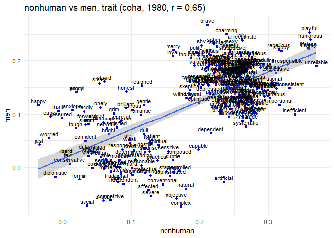

Tran_Riddle_Historical Embeddings
================
Nela Riddle
December 3, 2024

``` r
## Load in data ----
## Set WD to word stimuli
setwd("wordstim")

# Function to read and process lists
read_list <- function(file, col_name) {
  list_data <- read.delim(file, header = FALSE)
  colnames(list_data) <- col_name
  return(as.vector(list_data[[col_name]]))
}

# Specific groups (men, women)
groupwrds <- read.csv("groupstimlists.csv", header = FALSE)
groupwrds <- as.data.frame(t(groupwrds))
colnames(groupwrds) <- as.character(groupwrds[1, ])
groupwrds <- groupwrds[-1, ]

# Read lists using the function
agentic <- read_list("agentic.txt", "agentic")
communal <- read_list("communal.txt", "communal")
trait <- read_list("traitlist.txt", "trait")
job <- read_list("joblist.txt", "job")

print(head(agentic))
```

    ## [1] "able"           "accomplish"     "accomplishment" "accuracy"      
    ## [5] "accurate"       "achieve"

``` r
print(groupwrds$men)
```

    ##  [1] "men"         "man"         "male"        "males"       "masculine"  
    ##  [6] "masculinity" "he"          "him"         "his"         "himself"    
    ## [11] "mr"          "mister"      "boy"         "boys"        "guy"        
    ## [16] "guys"        "fella"       "fellas"      "gent"        "gents"      
    ## [21] "sir"         "sirs"        "bloke"       "blokes"      "gentleman"  
    ## [26] "gentlemen"   "lad"         "lads"        "prince"      "princes"    
    ## [31] "manly"       "king"        "kings"       ""            ""

``` r
plot_one_decade(get_decade("men", "women", "agentic", "coha", 1800))
```

    ## `geom_smooth()` using formula = 'y ~ x'

<!-- -->

``` r
plot_one_decade(get_decade("men", "women", "communal", "coha", 1800))
```

    ## `geom_smooth()` using formula = 'y ~ x'

<!-- -->

``` r
plot_one_decade(get_decade("men", "women", "agentic", "coha", 1810))
```

    ## `geom_smooth()` using formula = 'y ~ x'

<!-- -->

``` r
plot_one_decade(get_decade("men", "women", "agentic", "coha", 1820))
```

    ## `geom_smooth()` using formula = 'y ~ x'

<!-- -->

``` r
plot_one_decade(get_decade("men", "women", "agentic", "engall", 1990))
```

    ## `geom_smooth()` using formula = 'y ~ x'

<!-- -->

``` r
plot_one_decade(get_decade("men", "women", "communal", "engall", 1800))
```

    ## `geom_smooth()` using formula = 'y ~ x'

<!-- -->

``` r
plot_one_decade(get_decade("men", "women", "communal", "engall", 1990))
```

    ## `geom_smooth()` using formula = 'y ~ x'

<!-- -->

``` r
head(get_decade("men", "women", "agentic", "engall", 1990))
```

    ##                     grp1ef       grp2ef          trait
    ## able            0.03830098 -0.019302234           able
    ## accomplish     -0.02177715 -0.053832454     accomplish
    ## accomplishment  0.02045993  0.005052507 accomplishment
    ## accuracy       -0.05605307 -0.069085822       accuracy
    ## accurate       -0.03337303 -0.060975881       accurate
    ## achieve        -0.04780008 -0.064694855        achieve

``` r
# How many group words are missing by decade?
groupmiss_coha <- as.data.frame(matrix(nrow = length(wordvecs.dat_coha), ncol = dim(groupwrds)[2]))
colnames(groupmiss_coha) <- colnames(groupwrds)

for (j in 1:dim(groupwrds)[2]){
  for (i in 1:length(wordvecs.dat_coha)){
    groupmiss_coha[i,j] <- length(groupwrds[,j][groupwrds[,j] %in% unavwords_coha[[i]]])
  }}

# How many group words are there available?
for (i in 1:dim(groupwrds)[2]){
  groupmiss_coha[21,i] <- as.numeric(table(groupwrds[,i] == "")[1])
}

groupmiss2_coha <- as.data.frame(matrix(nrow = length(wordvecs.dat_coha), ncol = dim(groupwrds)[2]))
colnames(groupmiss2_coha) <- colnames(groupwrds)

for (j in 1:dim(groupmiss_coha)[2]){
  for (i in 1:20){
    groupmiss2_coha[i,j] <- 1 - (groupmiss_coha[i,j]/groupmiss_coha[21,j])
  }}

# Create a sequence for the x-axis (1820 to 2010, every 10 years)
years <- seq(1820, 2010, by = 10)

# Ensure the length of the data matches the length of `years`
# Assuming `men` and `women` are columns in groupmiss2_coha
groupmiss2_coha$year <- years

head(groupmiss2_coha)
```

    ##         men     women     human  nonhuman year
    ## 1 0.4242424 0.3714286 0.5000000 0.1111111 1820
    ## 2 0.5757576 0.5714286 0.6428571 0.4444444 1830
    ## 3 0.6969697 0.6571429 0.6428571 0.6111111 1840
    ## 4 0.6666667 0.6857143 0.6428571 0.6111111 1850
    ## 5 0.6969697 0.7142857 0.6428571 0.6666667 1860
    ## 6 0.6969697 0.7142857 0.7142857 0.6666667 1870

``` r
# Create the plot
ggplot(groupmiss2_coha, aes(x = year)) +
  geom_line(aes(y = men, color = "Men")) +
  geom_line(aes(y = women, color = "Women")) +
  scale_color_manual(values = c("Men" = "blue", "Women" = "red")) +
  labs(title = "prop. group words available over time",
       x = "Years",
       y = "Values",
       color = "Legend") +
  theme_minimal()
```

<!-- -->

``` r
# Values above or below 3 standard deviations from the mean
outliers_men <- groupmiss2_coha$men[abs(groupmiss2_coha$men - mean(groupmiss2_coha$men, na.rm = TRUE)) > 3 * sd(groupmiss2_coha$men, na.rm = TRUE)]
outliers_women <- groupmiss2_coha$women[abs(groupmiss2_coha$women - mean(groupmiss2_coha$women, na.rm = TRUE)) > 3 * sd(groupmiss2_coha$women, na.rm = TRUE)]
outliers_men
```

    ## [1] 0.4242424

``` r
outliers_women
```

    ## [1] 0.3714286

``` r
# Initialize an empty data frame to store results
results_df <- data.frame(
  year = integer(),
  agentic_coha_men = numeric(),
  agentic_coha_women = numeric(),
  agentic_engall_men = numeric(),
  agentic_engall_women = numeric(),
  communal_coha_men = numeric(),
  communal_coha_women = numeric(),
  communal_engall_men = numeric(),
  communal_engall_women = numeric(),
  stringsAsFactors = FALSE
)

# Define the parameters to iterate over
traits <- c("agentic", "communal")
corpora <- c("coha", "engall")
years <- seq(1800, 1990, by = 10)

# Loop through each year
for (year in years) {
  # Create a temporary vector to store the values for the current year
  temp_row <- c(year)
  
  # Loop through each combination of trait and corpus
  for (trait in traits) {
    for (corpus in corpora) {
      # Call the get_decade function
      df <- get_decade("men", "women", trait, corpus, year)
      
      # Calculate the mean of men and women individually
      mean_men <- mean(df$grp1ef, na.rm = TRUE)
      mean_women <- mean(df$grp2ef, na.rm = TRUE)
      
      # Append the means to the temporary row
      temp_row <- c(temp_row, mean_men, mean_women)
    }
  }
  
  # Append the temporary row to the results_df data frame
  results_df <- rbind(results_df, temp_row)
}

# Set the column names for the results data frame
colnames(results_df) <- c(
  "year",
  "agentic_coha_men", "agentic_coha_women",
  "agentic_engall_men", "agentic_engall_women",
  "communal_coha_men", "communal_coha_women",
  "communal_engall_men", "communal_engall_women"
)

# Display the results
print(results_df)
```

    ##    year agentic_coha_men agentic_coha_women agentic_engall_men
    ## 1  1800      0.084520244       0.1834998786        0.017776823
    ## 2  1810      0.036986220       0.0403678799        0.013167537
    ## 3  1820      0.017284895      -0.0044068025        0.004411563
    ## 4  1830      0.001474853       0.0003878655        0.008945463
    ## 5  1840      0.018157545      -0.0073481485        0.003948094
    ## 6  1850      0.001449928      -0.0022702158        0.011462237
    ## 7  1860      0.022906022      -0.0126401864        0.012631418
    ## 8  1870      0.023492385      -0.0030534677        0.014424021
    ## 9  1880      0.029276455      -0.0018925372        0.015541094
    ## 10 1890      0.045164065       0.0407958010        0.011824326
    ## 11 1900      0.047460166       0.0449100188        0.016932356
    ## 12 1910      0.048764028       0.0311070938        0.011144014
    ## 13 1920      0.050883157       0.0409740162        0.011922415
    ## 14 1930      0.055722354       0.0549758360        0.010657838
    ## 15 1940      0.041074543       0.0371632802        0.016404601
    ## 16 1950      0.040904315       0.0533711343        0.016927671
    ## 17 1960      0.069172537       0.0595801712        0.020153685
    ## 18 1970      0.077888404       0.0734545124        0.024377910
    ## 19 1980      0.065539308       0.0927835596        0.022926163
    ## 20 1990      0.113000601       0.0928455471        0.023448633
    ##    agentic_engall_women communal_coha_men communal_coha_women
    ## 1          -0.010094393        0.06831522          0.26509634
    ## 2          -0.003991037        0.07094547          0.09461830
    ## 3          -0.013642225        0.04259423          0.04840895
    ## 4          -0.010915581        0.02332175          0.04915821
    ## 5          -0.018247837        0.03831833          0.04037932
    ## 6          -0.006627975        0.02434804          0.04714489
    ## 7          -0.012494853        0.04691636          0.03207279
    ## 8          -0.010645491        0.04825870          0.04226237
    ## 9          -0.009744451        0.05070012          0.04076931
    ## 10         -0.006846959        0.06307972          0.08085304
    ## 11         -0.010041242        0.06972313          0.07941852
    ## 12         -0.006272388        0.07639868          0.06525074
    ## 13         -0.011133050        0.07874893          0.08073349
    ## 14         -0.010304977        0.07841097          0.08899034
    ## 15         -0.008795346        0.06771565          0.07719392
    ## 16         -0.004900174        0.06910422          0.09609614
    ## 17         -0.003272957        0.08933305          0.09344271
    ## 18          0.002779682        0.09297614          0.09949782
    ## 19          0.004748982        0.09342222          0.13549703
    ## 20          0.002629157        0.12533895          0.11913105
    ##    communal_engall_men communal_engall_women
    ## 1           0.04729696            0.05682278
    ## 2           0.02876524            0.03346980
    ## 3           0.02134274            0.02548101
    ## 4           0.02214370            0.02463863
    ## 5           0.02298446            0.02271996
    ## 6           0.02781557            0.02731800
    ## 7           0.02489244            0.02648915
    ## 8           0.02409834            0.02796862
    ## 9           0.02816929            0.02923253
    ## 10          0.02495898            0.02713827
    ## 11          0.03273924            0.02679150
    ## 12          0.02976279            0.02946129
    ## 13          0.03008241            0.02647452
    ## 14          0.03188849            0.02503512
    ## 15          0.03777427            0.03147545
    ## 16          0.03789944            0.03419810
    ## 17          0.04470092            0.03630398
    ## 18          0.04489457            0.03850274
    ## 19          0.04334782            0.03667643
    ## 20          0.03927364            0.03128763

``` r
ggplot(results_df, aes(x = year)) +
  geom_line(aes(y = communal_engall_men, color = "Men")) +
  geom_line(aes(y = communal_engall_women, color = "Women")) +
  labs(
    title = "Communal, engall",
    x = "Year",
    y = "Mean Values",
    color = "Group"
  ) +
  theme_minimal() +
  scale_color_manual(values = c("Men" = "blue", "Women" = "red"))
```

<!-- -->

``` r
ggplot(results_df, aes(x = year)) +
  geom_line(aes(y = agentic_engall_men, color = "Men")) +
  geom_line(aes(y = agentic_engall_women, color = "Women")) +
  labs(
    title = "Agentic, engall",
    x = "Year",
    y = "Mean Values",
    color = "Group"
  ) +
  theme_minimal() +
  scale_color_manual(values = c("Men" = "blue", "Women" = "red"))
```

<!-- -->

``` r
plot_one_ts(get_ts("nonhuman", "women", "trait", "coha"))
```

<!-- -->

``` r
plot_one_ts(get_ts("nonhuman", "men", "trait", "coha"))
```

<!-- -->

``` r
human_nonhuman_ts<-list(get_ts("nonhuman", "women", "trait", "coha"),get_ts("nonhuman", "men", "trait", "coha"), get_ts("nonhuman", "women", "trait", "engall"),get_ts("nonhuman", "men", "trait", "engall"),get_ts("men", "women", "trait", "engall"),get_ts("men", "women", "trait", "coha"))
plot_multiple_ts(human_nonhuman_ts)
```

<!-- -->

``` r
plot_one_decade(get_decade("nonhuman", "women", "trait", "engall", 1990))
```

    ## `geom_smooth()` using formula = 'y ~ x'

    ## Warning: Removed 17 rows containing non-finite values (`stat_smooth()`).

    ## Warning: Removed 17 rows containing missing values (`geom_point()`).

    ## Warning: Removed 17 rows containing missing values (`geom_text()`).

<!-- -->

``` r
plot_one_ts(get_ts("men", "women", "trait", "coha"))
```

<!-- -->

``` r
plot_one_ts(get_ts("men", "women", "job", "coha"))
```

<!-- -->

``` r
men_women_trait_job_ts<-list(get_ts("men", "women", "trait", "coha"), get_ts("men", "women", "job", "coha"), get_ts("men", "women", "trait", "engall"),get_ts("men", "women", "job", "engall"))
plot_multiple_ts(men_women_trait_job_ts)
```

<!-- -->

``` r
men_women_trait_job_ts<-list(get_ts("men", "women", "agentic", "coha"),get_ts("men", "women", "communal", "coha"), get_ts("men", "women", "agentic", "engall"),get_ts("men", "women", "communal", "engall"))
plot_multiple_ts(men_women_trait_job_ts)
```

<!-- -->

``` r
# plot_one_decade(get_decade("nonhuman", "women", "trait", "engall", 1990))
```
