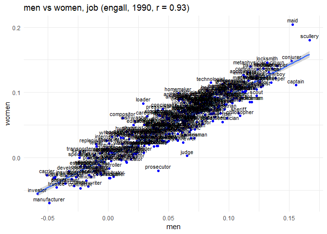
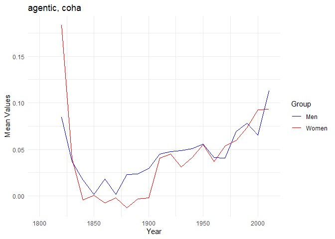

Tran_Riddle_Historical Embeddings
================
Nela Riddle
December 3, 2024

``` r
## Load in data ----
## Set WD to word stimuli
setwd("wordstim")

# Specific group examples and new lists
groupwrds <- read.csv("groupstimlists.csv", header = FALSE)
groupwrds <- as.data.frame(t(groupwrds))
colnames(groupwrds) <- as.character(groupwrds[1, ])
groupwrds <- groupwrds[-1, ]

## List of traits
agenticlist <- read.delim("agentic.txt", header = FALSE)
colnames(agenticlist) <- "agentic"
agentic <- as.vector(agenticlist$agentic)

## List of jobs
communallist <- read.delim("communal.txt", header = FALSE)
colnames(communallist) <- "communal"
communal <- as.vector(communallist$communal)

## List of traits
traitlist <- read.delim("traitlist.txt", header = FALSE)
colnames(traitlist) <- "trait"
trait <- as.vector(traitlist$trait)

## List of traits
joblist <- read.delim("joblist.txt", header = FALSE)
colnames(joblist) <- "job"
job <- as.vector(joblist$job)
```

``` r
plot_one_decade(get_decade("men", "women", "agentic", "engall", 1800))
```

    ## Warning: Removed 57 rows containing missing values (`geom_point()`).

    ## Warning: Removed 57 rows containing missing values (`geom_text()`).

<!-- -->

``` r
plot_one_decade(get_decade("men", "women", "agentic", "engall", 1990))
```

    ## Warning: Removed 1 rows containing missing values (`geom_point()`).

    ## Warning: Removed 1 rows containing missing values (`geom_text()`).

<!-- -->

``` r
plot_one_decade(get_decade("men", "women", "communal", "engall", 1800))
```

    ## Warning: Removed 93 rows containing missing values (`geom_point()`).

    ## Warning: Removed 93 rows containing missing values (`geom_text()`).

<!-- -->

``` r
plot_one_decade(get_decade("men", "women", "communal", "engall", 1990))
```

<!-- -->

``` r
print(get_decade("men", "women", "agentic", "engall", 1990))
```

    ##                       grp1ef        grp2ef          trait
    ## able            0.0383009843 -0.0193022341           able
    ## accomplish     -0.0217771521 -0.0538324537     accomplish
    ## accomplishment  0.0204599299  0.0050525069 accomplishment
    ## accuracy       -0.0560530672 -0.0690858218       accuracy
    ## accurate       -0.0333730270 -0.0609758810       accurate
    ## achieve        -0.0478000848 -0.0646948548        achieve
    ## achievement    -0.0217966302 -0.0268423255    achievement
    ## acquire        -0.0131087672 -0.0414675422        acquire
    ## adept           0.0015408855 -0.0023312694          adept
    ## ambition        0.1005507305  0.0632741739       ambition
    ## ambitious       0.0814333591  0.0510727892      ambitious
    ## aptitude        0.0151322798 -0.0085069013       aptitude
    ## aspiration     -0.0131051017 -0.0042188523     aspiration
    ## aspire          0.0807202449  0.0709244901         aspire
    ## aspiring        0.0905178101  0.0833931748       aspiring
    ## assert          0.0417210932 -0.0110608197         assert
    ## assertive       0.0282895992  0.0086466619      assertive
    ## attain          0.0150368099 -0.0022472079         attain
    ## autonomy        0.0020115190  0.0068974060       autonomy
    ## capability     -0.0730521165 -0.0825783160     capability
    ## capable        -0.0138290722 -0.0365398917        capable
    ## careful         0.0080112931 -0.0069286116        careful
    ## choice          0.0109906329 -0.0024420794         choice
    ## clever          0.1658973631  0.0952245841         clever
    ## cleverness      0.0978569686  0.0956810147     cleverness
    ## compete        -0.0029651758 -0.0281255449        compete
    ## competence     -0.0208735466 -0.0340131822     competence
    ## competent       0.0045723099 -0.0424620192      competent
    ## competition    -0.0502115250 -0.0458096316    competition
    ## competitive    -0.0647678598 -0.0689426426    competitive
    ## competitor      0.0062907276 -0.0023335515     competitor
    ## completion     -0.0928728089 -0.0541347523     completion
    ## confident       0.0841889172  0.0339028863      confident
    ## conquer         0.0672351838  0.0209536451        conquer
    ## conquering      0.1126841004  0.0785472100     conquering
    ## conqueror       0.1239850699  0.0841955965      conqueror
    ## conscientious   0.0551167637  0.0132123122  conscientious
    ## contemplate     0.0310952271  0.0302269114    contemplate
    ## contend         0.0421881079 -0.0332404400        contend
    ## contender       0.0535330826  0.0325671222      contender
    ## contest         0.0587664650  0.0459557690        contest
    ## contestant      0.0580747925  0.0607052091     contestant
    ## decide          0.0472219618 -0.0051078944         decide
    ## decision       -0.0102390970 -0.0451684228       decision
    ## decisive        0.0216766442 -0.0124953083       decisive
    ## defeat          0.0340425845 -0.0040674818         defeat
    ## defeated        0.0710196920  0.0243837344       defeated
    ## deliberate      0.0071185359 -0.0392595460     deliberate
    ## deliberation    0.0309836970 -0.0117031213   deliberation
    ## dependable      0.0040553427 -0.0243159680     dependable
    ## determination  -0.0468275815 -0.0679250190  determination
    ## determine      -0.0566336820 -0.0785793225      determine
    ## difficult       0.0125224468 -0.0326048665      difficult
    ## difficulty     -0.0118658342 -0.0242625974     difficulty
    ## do              0.1195625065  0.0544432942             do
    ## eager           0.1316318162  0.0949519186          eager
    ## earn            0.0602619542  0.0425260473           earn
    ## easy            0.0433525063  0.0112311341           easy
    ## effective      -0.0882807049 -0.1039076025      effective
    ## effectiveness  -0.0931822711 -0.0893208029  effectiveness
    ## efficiency     -0.0975994752 -0.0919394870     efficiency
    ## efficient      -0.0652001656 -0.0801422700      efficient
    ## effort         -0.0246968668 -0.0475426439         effort
    ## effortless      0.0870353132  0.0825831961     effortless
    ## endeavor        0.0190779948 -0.0171132858       endeavor
    ## establish      -0.0127135334 -0.0453251017      establish
    ## exact          -0.0124011250 -0.0208051462          exact
    ## exacting        0.0130011403 -0.0102227924       exacting
    ## expert         -0.0367758942 -0.0610660818         expert
    ## expertise      -0.0391199279 -0.0494758493      expertise
    ## fail            0.0067447770 -0.0417967554           fail
    ## failure        -0.0410473524 -0.0538714683        failure
    ## fluent          0.0404225255  0.0365913948         fluent
    ## freedom         0.0044318536  0.0069078607        freedom
    ## goal           -0.0314821578 -0.0537149285           goal
    ## importance     -0.0265002032 -0.0223540285     importance
    ## important      -0.0351817061 -0.0522160310      important
    ## independence   -0.0120462049  0.0003347799   independence
    ## independent    -0.0372094513 -0.0415631288    independent
    ## insight        -0.0013822729 -0.0081750250        insight
    ## insightful      0.0011183246  0.0268288460     insightful
    ## intent          0.0066223476 -0.0224937076         intent
    ## intention       0.0287868611 -0.0018488707      intention
    ## intentional    -0.0155736610 -0.0236561143    intentional
    ## intuition       0.0261156783  0.0115655005      intuition
    ## intuitive       0.0006654622 -0.0412468551      intuitive
    ## keen            0.0736349184  0.0422529768           keen
    ## know            0.1499526648  0.0897506654           know
    ## knowledge      -0.0247566496 -0.0333780288      knowledge
    ## knowledgeable   0.0417445945  0.0179271612  knowledgeable
    ## liberty         0.0305715635  0.0218579456        liberty
    ## logic          -0.0377324339 -0.0391436376          logic
    ## logical        -0.0278735613 -0.0424617485        logical
    ## loner           0.0917556918  0.0648216384          loner
    ## make            0.0464357982  0.0070859210           make
    ## masterful       0.0462283354  0.0379731197      masterful
    ## mastery        -0.0130354263 -0.0161958804        mastery
    ## motivate        0.0313202431 -0.0013331688       motivate
    ## motivation     -0.0212301734 -0.0450938904     motivation
    ## motivational   -0.0525509178 -0.0348459249   motivational
    ## need           -0.0190681666 -0.0537926894           need
    ## objective      -0.0653003929 -0.0770118594      objective
    ## objectivity     0.0114284040 -0.0006005272    objectivity
    ## obtain         -0.0421742446 -0.0540361306         obtain
    ## opportunity     0.0172336567 -0.0043510231    opportunity
    ## overcome       -0.0044393831 -0.0433604143       overcome
    ## perseverance    0.0573580544  0.0486532950   perseverance
    ## persist        -0.0320114836 -0.0468418245        persist
    ## persistence    -0.0168882318 -0.0013307258    persistence
    ## persistent      0.0083895825  0.0046829324     persistent
    ## pioneer         0.0274446528  0.0455102353        pioneer
    ## practical      -0.0216968151 -0.0635332564      practical
    ## practice       -0.0509985028 -0.0480261407       practice
    ## pragmatic       0.0221062018 -0.0129106330      pragmatic
    ## prevail         0.0266487486 -0.0151875128        prevail
    ## prevailing     -0.0511913595 -0.0513122860     prevailing
    ## pride           0.0867850103  0.0692235547          pride
    ## priority       -0.0452690021 -0.0547419941       priority
    ## proactive      -0.0093660985 -0.0130593565      proactive
    ## productive     -0.0170619644 -0.0236202950     productive
    ## productivity   -0.0823145981 -0.0594672835   productivity
    ## proficiency    -0.0247544788 -0.0349260211    proficiency
    ## proficient      0.0059175489  0.0065136191     proficient
    ## prosper         0.0587341745  0.0134261985        prosper
    ## prosperity     -0.0084698247  0.0155731807     prosperity
    ## prosperous      0.0894741798  0.0746540046     prosperous
    ## proud           0.1533000496  0.1169429606          proud
    ## purpose        -0.0473188809 -0.0539895095        purpose
    ## pursue          0.0224705889 -0.0065862076         pursue
    ## pursuit         0.0298013282  0.0200671871        pursuit
    ## rational        0.0043428119 -0.0159716232       rational
    ## rationalize     0.0131022529 -0.0296384515    rationalize
    ## realization    -0.0408807470 -0.0333213179    realization
    ## realize         0.0788664427  0.0312453620        realize
    ## rebel           0.1283495270  0.1109477970          rebel
    ## rebellion       0.0420679398  0.0173416359      rebellion
    ## rebellious      0.1072988200  0.0891249626     rebellious
    ## recognition    -0.0337145099 -0.0352655803    recognition
    ## recognizable    0.0465559307  0.0284280442   recognizable
    ## recognize       0.0312841909 -0.0073601085      recognize
    ## reliable       -0.0349227939 -0.0575967216       reliable
    ## reputation      0.0726099590  0.0424650005     reputation
    ## resilient       0.0702423254  0.0319448219      resilient
    ## resolute        0.0818914802  0.0489553933       resolute
    ## resolution     -0.0491853788 -0.0538087978     resolution
    ## resolve         0.0020098316 -0.0425437972        resolve
    ## responsibility  0.0117695563 -0.0217093218 responsibility
    ## responsible    -0.0381175300 -0.0642542904    responsible
    ## reward          0.0404480790  0.0231842820         reward
    ## rewarding       0.0353622052  0.0140992062      rewarding
    ## risk           -0.0307302763 -0.0215998756           risk
    ## risky           0.0215927216 -0.0090067555          risky
    ## savvy           0.1068998300  0.1029503757          savvy
    ## score           0.0230890437  0.0099342717          score
    ## self            0.0191317540  0.0097619253           self
    ## shoulder        0.1087715450  0.0895806687       shoulder
    ## significant    -0.0522945796 -0.0630162539    significant
    ## skill           0.0280035965 -0.0046509015          skill
    ## skilled         0.0150154254 -0.0035452225        skilled
    ## skillful        0.0808612473  0.0396900340       skillful
    ## smart           0.1342092589  0.0847369586          smart
    ## steadfast       0.0826817634  0.0838173496      steadfast
    ## strive          0.0283125820 -0.0143333435         strive
    ## struggle        0.0401497860  0.0205529716       struggle
    ## stubborn        0.1136704311  0.0703561498       stubborn
    ## stubbornness    0.1048205399  0.1075380648   stubbornness
    ## succeed         0.0434211443  0.0114427490        succeed
    ## success        -0.0107659118 -0.0138143842        success
    ## successful      0.0036114576 -0.0158616812     successful
    ## succession     -0.0111851735 -0.0162115099     succession
    ## successor       0.0506787889  0.0231828801      successor
    ## sure            0.1042290813  0.0367154106           sure
    ## take            0.0523470381  0.0104168833           take
    ## tenacious       0.0818577085  0.0993904286      tenacious
    ## think           0.1444407313  0.0694068307          think
    ## thinker         0.0921863094  0.0620681088        thinker
    ## thought         0.1277082688  0.0809609864        thought
    ## triumph         0.0787632447  0.0685298602        triumph
    ## triumphant      0.0702616597  0.0726527738     triumphant
    ## vanquish        0.1284517376  0.1120010334       vanquish
    ## vanquished      0.0929275487  0.0813031680     vanquished
    ## vanquishing              NaN           NaN    vanquishing
    ## victorious      0.0819309679  0.0543528644     victorious
    ## victory         0.0542943054  0.0355388110        victory
    ## will            0.0183851479 -0.0386096551           will
    ## willing         0.0797611476  0.0132363350        willing
    ## willingness    -0.0030665390 -0.0441783543    willingness
    ## willpower       0.0812954858  0.0979188098      willpower
    ## win             0.0765734873  0.0341200712            win
    ## winner          0.0578777319  0.0518666549         winner
    ## winnings        0.0633482608  0.0474382181       winnings
    ## wit             0.1204277190  0.0781132559            wit

``` r
# Initialize an empty data frame to store results
results_df <- data.frame(
  year = integer(),
  agentic_coha_men = numeric(),
  agentic_coha_women = numeric(),
  agentic_engall_men = numeric(),
  agentic_engall_women = numeric(),
  communal_coha_men = numeric(),
  communal_coha_women = numeric(),
  communal_engall_men = numeric(),
  communal_engall_women = numeric(),
  stringsAsFactors = FALSE
)

# Define the parameters to iterate over
traits <- c("agentic", "communal")
corpora <- c("coha", "engall")
years <- seq(1800, 1990, by = 10)

# Loop through each year
for (year in years) {
  # Create a temporary vector to store the values for the current year
  temp_row <- c(year)
  
  # Loop through each combination of trait and corpus
  for (trait in traits) {
    for (corpus in corpora) {
      # Call the get_decade function
      df <- get_decade("men", "women", trait, corpus, year)
      
      # Calculate the mean of men and women individually
      mean_men <- mean(df$grp1ef, na.rm = TRUE)
      mean_women <- mean(df$grp2ef, na.rm = TRUE)
      
      # Append the means to the temporary row
      temp_row <- c(temp_row, mean_men, mean_women)
    }
  }
  
  # Append the temporary row to the results_df data frame
  results_df <- rbind(results_df, temp_row)
}

# Set the column names for the results data frame
colnames(results_df) <- c(
  "year",
  "agentic_coha_men", "agentic_coha_women",
  "agentic_engall_men", "agentic_engall_women",
  "communal_coha_men", "communal_coha_women",
  "communal_engall_men", "communal_engall_women"
)

# Display the results
print(results_df)
```

    ##    year agentic_coha_men agentic_coha_women agentic_engall_men agentic_engall_women communal_coha_men
    ## 1  1800      0.084520244       0.1834998786        0.017776823         -0.010094393        0.06831522
    ## 2  1810      0.036986220       0.0403678799        0.013167537         -0.003991037        0.07094547
    ## 3  1820      0.017284895      -0.0044068025        0.004411563         -0.013642225        0.04259423
    ## 4  1830      0.001474853       0.0003878655        0.008945463         -0.010915581        0.02332175
    ## 5  1840      0.018157545      -0.0073481485        0.003948094         -0.018247837        0.03831833
    ## 6  1850      0.001449928      -0.0022702158        0.011462237         -0.006627975        0.02434804
    ## 7  1860      0.022906022      -0.0126401864        0.012631418         -0.012494853        0.04691636
    ## 8  1870      0.023492385      -0.0030534677        0.014424021         -0.010645491        0.04825870
    ## 9  1880      0.029276455      -0.0018925372        0.015541094         -0.009744451        0.05070012
    ## 10 1890      0.045164065       0.0407958010        0.011824326         -0.006846959        0.06307972
    ## 11 1900      0.047460166       0.0449100188        0.016932356         -0.010041242        0.06972313
    ## 12 1910      0.048764028       0.0311070938        0.011144014         -0.006272388        0.07639868
    ## 13 1920      0.050883157       0.0409740162        0.011922415         -0.011133050        0.07874893
    ## 14 1930      0.055722354       0.0549758360        0.010657838         -0.010304977        0.07841097
    ## 15 1940      0.041074543       0.0371632802        0.016404601         -0.008795346        0.06771565
    ## 16 1950      0.040904315       0.0533711343        0.016927671         -0.004900174        0.06910422
    ## 17 1960      0.069172537       0.0595801712        0.020153685         -0.003272957        0.08933305
    ## 18 1970      0.077888404       0.0734545124        0.024377910          0.002779682        0.09297614
    ## 19 1980      0.065539308       0.0927835596        0.022926163          0.004748982        0.09342222
    ## 20 1990      0.113000601       0.0928455471        0.023448633          0.002629157        0.12533895
    ##    communal_coha_women communal_engall_men communal_engall_women
    ## 1           0.26509634          0.04729696            0.05682278
    ## 2           0.09461830          0.02876524            0.03346980
    ## 3           0.04840895          0.02134274            0.02548101
    ## 4           0.04915821          0.02214370            0.02463863
    ## 5           0.04037932          0.02298446            0.02271996
    ## 6           0.04714489          0.02781557            0.02731800
    ## 7           0.03207279          0.02489244            0.02648915
    ## 8           0.04226237          0.02409834            0.02796862
    ## 9           0.04076931          0.02816929            0.02923253
    ## 10          0.08085304          0.02495898            0.02713827
    ## 11          0.07941852          0.03273924            0.02679150
    ## 12          0.06525074          0.02976279            0.02946129
    ## 13          0.08073349          0.03008241            0.02647452
    ## 14          0.08899034          0.03188849            0.02503512
    ## 15          0.07719392          0.03777427            0.03147545
    ## 16          0.09609614          0.03789944            0.03419810
    ## 17          0.09344271          0.04470092            0.03630398
    ## 18          0.09949782          0.04489457            0.03850274
    ## 19          0.13549703          0.04334782            0.03667643
    ## 20          0.11913105          0.03927364            0.03128763

``` r
ggplot(results_df, aes(x = year)) +
  geom_line(aes(y = communal_engall_men, color = "Men")) +
  geom_line(aes(y = communal_engall_women, color = "Women")) +
  labs(
    title = "Communal, engall",
    x = "Year",
    y = "Mean Values",
    color = "Group"
  ) +
  theme_minimal() +
  scale_color_manual(values = c("Men" = "blue", "Women" = "red"))
```

<!-- -->

``` r
ggplot(results_df, aes(x = year)) +
  geom_line(aes(y = agentic_engall_men, color = "Men")) +
  geom_line(aes(y = agentic_engall_women, color = "Women")) +
  labs(
    title = "Agentic, engall",
    x = "Year",
    y = "Mean Values",
    color = "Group"
  ) +
  theme_minimal() +
  scale_color_manual(values = c("Men" = "blue", "Women" = "red"))
```

<!-- -->

``` r
plot_one_ts(get_ts("nonhuman", "women", "trait", "coha"))
```

<!-- -->

``` r
plot_one_ts(get_ts("nonhuman", "men", "trait", "coha"))
```

<!-- -->

``` r
human_nonhuman_ts<-list(get_ts("nonhuman", "women", "trait", "coha"),get_ts("nonhuman", "men", "trait", "coha"), get_ts("nonhuman", "women", "trait", "engall"),get_ts("nonhuman", "men", "trait", "engall"),get_ts("men", "women", "trait", "engall"),get_ts("men", "women", "trait", "coha"))
plot_multiple_ts(human_nonhuman_ts)
```

<!-- -->

``` r
plot_one_decade(get_decade("nonhuman", "women", "trait", "engall", 1990))
```

    ## Warning: Removed 17 rows containing missing values (`geom_point()`).

    ## Warning: Removed 17 rows containing missing values (`geom_text()`).

<!-- -->

``` r
plot_one_ts(get_ts("men", "women", "trait", "coha"))
```

<!-- -->

``` r
plot_one_ts(get_ts("men", "women", "job", "coha"))
```

<!-- -->

``` r
men_women_trait_job_ts<-list(get_ts("men", "women", "trait", "coha"), get_ts("men", "women", "job", "coha"), get_ts("men", "women", "trait", "engall"),get_ts("men", "women", "job", "engall"))
plot_multiple_ts(men_women_trait_job_ts)
```

<!-- -->

``` r
men_women_trait_job_ts<-list(get_ts("men", "women", "agentic", "coha"), get_ts("men", "women", "communal", "coha"), get_ts("men", "women", "agentic", "engall"),get_ts("men", "women", "communal", "engall"))
plot_multiple_ts(men_women_trait_job_ts)
```

<!-- -->

``` r
# plot_one_decade(get_decade("nonhuman", "women", "trait", "engall", 1990))
```
