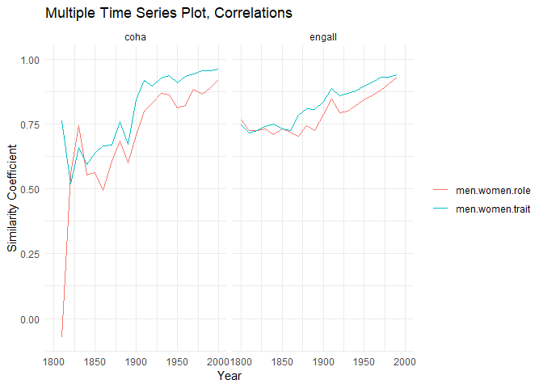
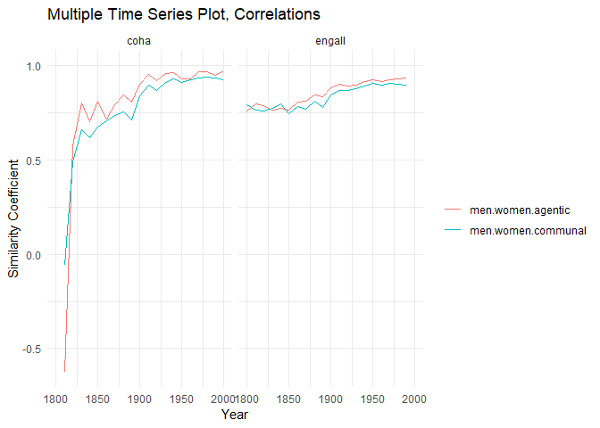

```{css, echo=FALSE}
div.title_container{
   background-color: #990000;
}

div.logo_left{
  background-color: #990000;
}
div.logo_right{
  background-color: #990000;
}

.poster_body h1{
  background-color: #990000;
  border: #990000;
}

table {
  border-collapse: collapse;
  width: 100%;
}

th, td {
  border: 1px solid black;
  padding: 8px;
  text-align: left;
}

th {
  background-color: #f2f2f2;
}
```

# Introduction
Stereotypes about men and women have evolved over time, reflecting both real and perceived changes in gender roles. Prior research has shown that traits historically associated with men and women have shifted due to societal transformations [@eagly2020stereotypes; @gustafsson2019; @diekman2000stereotypes]. While men and women are perceived to be becoming more similar in their traits, persistent gender gaps in agency and communion remain. However, these findings often rely on self-report data, which can introduce observer effects and inflate gender differences or similarities.

To overcome these limitations, we leverage large-scale, naturalistic human-generated text data as a measure of gender conceptualizations over time. Written language encodes societal beliefs, attitudes, and stereotypes about men and women, providing a rich source of insight into collective social representations [@bailey2022based]. By analyzing word embeddings, we can track the evolution of gender-trait associations from the 19th century to the present.

Guided by Social Roles Theory, we investigate how changes in gendered labor distributions correspond to shifts in trait perceptions. As gender segregation in social roles diminishes, we expect trait inferences about men and women to converge.

# Purpose
Our study aims to expand upon previous findings by examining stereotype change on a larger scale using naturalistic data, providing insight into the long-term trajectory of gender conceptualizations.

# Methods
| Corpus  | EngAll | COHA |
|---------|--------|------|
| **Long Title** | Google Books Ngram Corpus, All English | Corpus of Historical American English |
| **Sources** | Books predominantly in the English language published in any country | American text from the 1820s-2010s (fiction, magazine, newspaper, non-fiction, TV/movies) |
| **Genre-balanced?** | No | Yes |
| **Total Words** | 850 billion | 410 million |
| **Decades** | 1800-1999 | 1820-2009 |

The Mean Average Correlation (MAC) was the main metric used, with the following process: 

* Compile word lists (trait, job, agentic, communal)

* Compute MAC score between each word in list and "men," "women" for a given decade

    * A higher score implies higher similarity between the group and term

* Plot and compute Pearson correlation

* Measure change in correlation over time; increase suggests groups have grown more similar with respect to a word list


```{r, fig.show="hold", out.width="49%", echo=FALSE, fig.cap="Sample decade graphs",  fig.align="center"}

knitr::include_graphics(c(
  "../histembeddingsGender_files/figure-markdown_strict/plottingDecade-1.png",
  "../histembeddingsGender_files/figure-markdown_strict/plottingDecade-2.png"
))
```

# Results
```{r overall, echo=FALSE, fig.cap="Trends in role and trait terms", out.width="70%", fig.align="center"}

```


```{r overall2, echo=FALSE, fig.cap="Trends in communal and agentic traits", out.width="70%", fig.align="center"}

```

```{r overall3, echo=FALSE, fig.cap="Trends in magnitude, engall", out.width="70%", fig.align="center"}
knitr::include_graphics("../histembeddingsGender_files/figure-gfm/plottingTsMenWomenAverages-1.png")
```

# Discussion
Over time, men and women have increasingly been conceptualized as occupying similar roles and possessing similar traits. This trend reflects a broader societal shift toward perceiving men and women as more alike in both agency and communion. Our findings indicate that the convergence in agency is larger than in communion, aligning with prior research (cf. Gustafsson Sendén et al., 2019). By utilizing a naturalistic and unobtrusive measure—human-generated texts—we provide an alternative to self-report methods, which may inflate gender similarities or differences due to observer effects.

Importantly, our study captures these shifts over a broad temporal scope, stretching back to the early 19th century. While historical shifts in language present challenges, such as semantic drift (e.g., the word “gay” shifting in meaning over time), our approach mitigates this concern by analyzing word proximity to men and women at the same time points. This ensures that changes in word meaning do not compromise our measure of gender similarity in conceptualization.

# References
